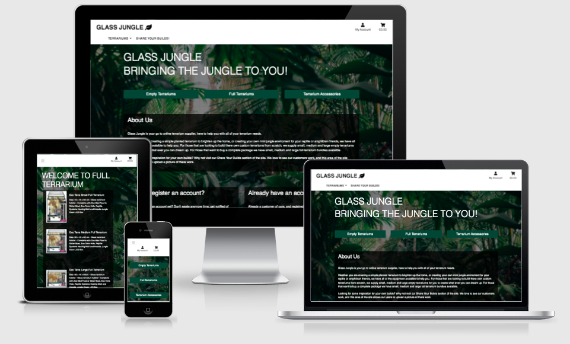
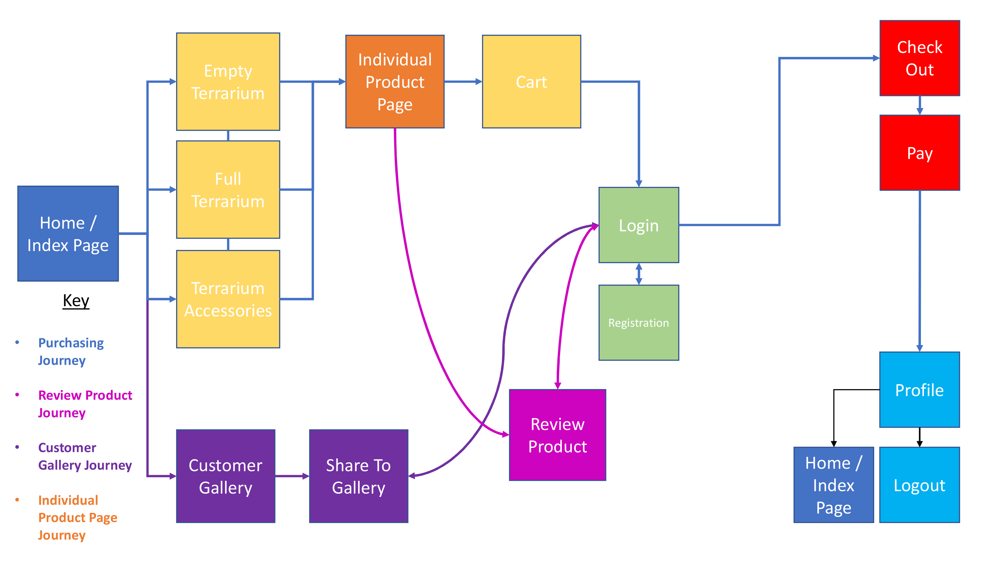
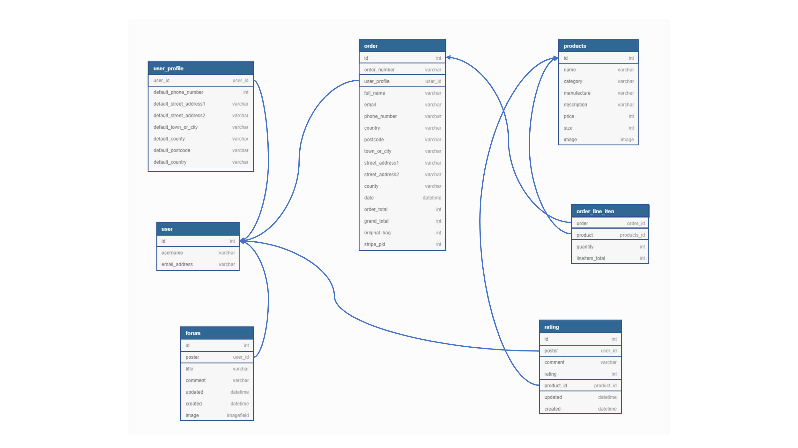

# Glass Jungle Website

  

<a  href="https://glass-jungle.herokuapp.com/">View the live project here..</a>

  

This site is for a new and emerging company called Glass Jungle. It is designed to be responsive and accessible on a range of devices and have interactive elements to help meet the clients key goals.

  

The company's prime mission statement is to offer their customers a platform to purchase all of their terrarium building needs. Whether thats making a terrarium for decorative purposes, or making a naturalistic environment for a pet reptile or amphibian. Glass Jungle wants to be able to offer full range of products to cover that application. So the primary goal for this website is to provide Glass Jungle's customers with an e-commerce platform in which to purchase products. The client (Glass Jungle) also wants to start building a online community, connecting their customers together to encourage them to share their projects on the website. The "Share Your Builds" section of the site will not only help start building an online community, it will also increase future sales. Potential customers will be able to visit the "Share Your Builds" section to gain inspiration for their own builds, thus turning an indecisive customer into a divisive one. In order to make the "Share Your Builds" section function correctly the site will need to allow customers to register an account. The account will show them their purchase history, allow them to leave a review on a product and also upload a post on the "Share Your Builds" section of the site.

    

  

## Client Requirements

* We need the platforms aesthetics to connect with the companies key demographic.

  

* We need a platform that succinctly explains who we are and the function of the company.

  

* We need a platform that succinctly explains how to navigate across the site, no matter the device used, to view the site.

  

* We need a platform that allows those visiting to register an account with us.

  

* We need a platform that allows those who have registered an account to log in and log out freely.

  

* We need a platform that allows those who have registered to leave reviews of products.

  

* We need a platform that allows those who have registered to share an image and a description of there own terrarium builds.

  

* We need a platform that allows users to purchase product.

  

* We need a platform that notifies registered users of their previous purchase history.

  

## User Experience (UX)

  

### User Stories

  

#### First Time Visitor Goals

  

1. As a First Time Visitor, I want to easily understand the main purpose of the site, and learn more about the company.

2. As a First Time Visitor, I want to be able to easily navigate through the site to find key content.

3. As a First Time Visitor, I want to clearly find out how to register for an account.

4. As a First Time Visitor, I want to be able to find out what products the site offers.

5. As a First Time Visitor, I want to be able to choose what product I want and complete a transaction.

  

#### Returning Visitor Goals

  

1. As a Returning Visitor, I want to be able to log into my account quickly.

2. As a Returning Visitor, I want to be able to register an account if not already.

3. As a Returning Visitor, I want to be able to visit my profile easily.

4. As a Returning Visitor, I want to be able to leave a review on a product easily.

5. As a Returning Visitor, I want to be able to leave a post on the community section of the site easily.

  

#### Frequent User Goals

1. As a Frequent User, I want to be able to see my previous purchase history.

2. As a Frequent User, I want to be able to edit or delete my product reviews.

3. As a Frequent User, I want to be able to edit or delete my posts from the community section of the site.

4. As a Frequent User, I want to be able to edit or amend by default delivery information on my profile.

  

## Design

  

### Colour Scheme

  

From the outset of building this site I wanted to take its key design features from one image. The image would be used as a background for the body of the site, and this background would feature across the site. This would ensure a cohesive design aesthetic across the site. The image needed to be tropical, exotic and lush in order to connect with the clients key demographic. I came across an amazing image on [Unsplashed](https://unsplash.com/) by a photographer called <a  href="https://unsplash.com/@chrisabney">Chris Abney</a>. The image is of a stunning rainforest and perfectly connects with the demographic and meets the needs of my initial design plan. Using the image I was able to decide a colour palette to use across the site that would compliment the image, and fit with my design brief. I used a website called [Coolors](https://coolors.co/), and uploaded the image by Chris Abney into its "create palette from photo" feature. I've included a list below of colours I ended up settling on:

  

* #002416 - Dark Green

* #114634 - Brunswick Green

* #02661D - Pakistan Green

* #9CC24D - Android Green

* #24171B - Raisian Black

  

### Typography

  

Rubik is the font chosen for use across the site, with Sans Serif as the back up font in case there are any issues importing into the site correctly from Google Fonts. As I do with all my projects, I research different fonts to find the best one that would work with my design brief. Recently I came across an article by [awwards](https://www.awwwards.com/) website called the <a  href="https://www.awwwards.com/20-best-web-fonts-from-google-web-fonts-and-font-face.html">20 Best Google Web Fonts</a>. This article is full of some fantastic fonts, but I felt Rubik would work best due to its bold and modern appearance.

  

### Wireframe Mockups - Desktop

  

*  <a  href="readme_assets/readme_images/Home Page Desktop View.png">Home Page Desktop View</a>

*  <a  href="readme_assets/readme_images/Home Page Desktop View Scroll.png">Home Page Desktop View Scroll</a>

*  <a  href="readme_assets/readme_images/Products Page Desktop View.png">Products Page Desktop View</a>

*  <a  href="readme_assets/readme_images/Products Detail Page Desktop View.png">Products Detail Page Desktop View</a>

*  <a  href="readme_assets/readme_images/Cart Page Desktop View.png">Cart Page Desktop View</a>

*  <a  href="readme_assets/readme_images/Checkout Page Desktop View.png">Checkout Page Desktop View</a>

*  <a  href="readme_assets/readme_images/Share Your Builds Page Desktop View.png">Share Your Builds Page Desktop</a>

*  <a  href="readme_assets/readme_images/Share Your Builds Form Desktop VIew.png">Your Builds Form Desktop View</a>

  

### Wireframe Mockups - Mobile

  

*  <a  href="readme_assets/readme_images/Home Page iPhone View.png">Home Page iPhone View</a>

*  <a  href="readme_assets/readme_images/Home Page iPhone View Scroll.png">Home Page iPhone View Scroll</a>

*  <a  href="readme_assets/readme_images/Products Page iPhone View.png">Products Page iPhone View</a>

*  <a  href="readme_assets/readme_images/Product Detail iPhone View.png">Products Detail Page iPhone View</a>

*  <a  href="readme_assets/readme_images/Cart Page iPhone View.png">Cart Page iPhone View</a>

*  <a  href="readme_assets/readme_images/Checkout Page iPhone View.png">Checkout Page iPhone View</a>

*  <a  href="readme_assets/readme_images/Share Your Builds Page iPhone View.png">Share Your Builds iPhone View</a>

*  <a  href="readme_assets/readme_images/Share Your Builds Form iPhone View.png">Your Builds Form iPhone View</a>

  

## Features

Each page of this site shares the same header and navigation bar. The header contains the clients logo and navigational links to all areas of the site. The navigation bar runs the length of the page and is fixed to the top of the page throughout the site. The navigation bar contains the company logo, which acts as a link to the "Home" page. In addition it has a drop down menu for the three category of products that are on sale on the site. These categories are "Empty Terrarium", "Full Terrarium" and "Terrarium Accessories". Next to the drop down is a link to the "Share Your Builds" page. The far right of the navigation bar is a link to the "Account" and "Cart" section of the site. The colour of the font used in the navigation bar is black with a white background colour. This is the only area of the site with this colour combination. I wanted the user of the site to associate this colour combination with navigation, making it easier for returning and frequent visitors to navigate across the site.

<b><i>Home</i></b>

I wanted the Home page to have all of the information a first time visitor could require and hopefully turn them into a returning visitor. However, there was a danger in doing so that the home page would become too overbearing. The home page is the first page a user will arrive at so creating the right first impression was important. Capturing the users attention and connecting with the demographic of user was also vital.  Therefore I've used cards with semi transparent backgrounds, to contain key information of the site. In combination with the white font  the background helps the font catch the users eye and interest in its content. In addition, the background image connects with user and the complimentary colours I've used for the call to action buttons help everything gel together. 

The Home page is split into three sections. The first section has three identical call to action buttons, which take the visitor to the three categories of the web store, "Empty Terrarium", "Full Terrarium" and "Terrarium Accessories". The e-commerce experience is the primary function of the site, and so its critical that the user can navigate to it with as little clicks as possible. There are two primary colour combinations of call to action buttons across this site. Each colour combination denotes a different result once the button is clicked. For example, dark green for progressing the users transaction journey and light green for regressing the transaction journey. This theme is used across the site keeping the aesthetic consistent. The second section of the Home page is the About Us section, informing the visitor exactly who the company is, what they stand for and what they have to offer. The third and final section of the Home page is split into two sections one directing the user to the area of the site where they can register for an account. The second section is directing the user to log in page, assuming they have already registered for an account. Although the web store is a vital section of the site, all the key features of the site are enhanced when a user has registered an account. Therefore, allowing the user to register an account, or log in easily is paramount.

<b><i>Product Page </i></b>

As mentioned previously the e-commerce aspect of the site is its main purpose. Therefore displaying the product avalaible on the site was an important feature to get right. This would be the first step in the users journey to complete a transaction. The products are divided into three categories "Empty Terrarium", "Full Terrarium" and "Terrarium Accessories". To make the decision process easier for the user, each product category has a small, medium and large option. Keeping it simple not only speeds up the decision process and leads to more sales, but from a design perspective it allows for a simple design approach, which a user can absorb more easily. Therefore, I decided that each category should have its own identical product page. The Product page like all the rest of the website has the navigation bar at the top of the page to ensure consistency throughout the site, just below that is a heading with the category title. The main content of the page is a card. Each sized product has its own card, with an image of the product, the title of the product and where applicable a brief description. The background of the card is slightly transparent, in combination with the white text catches the users eye and denotes the information displayed is important and worth taking notice of. Each product image within the card is a link to the associated products "Product Detail" page. The user can click the product they are interested in and this then progresses the user forward in the transaction journey.

<b><i>Product Detail Page </i></b>

The Product Detail page is the next step in a user completing a transaction. Once again the navigation bar is situated at the top of the page, should the user decide they are no longer interested in the product they are viewing and want to navigate back to the rest of the products on the site. Just below the navigation is a heading with the title of the product. Unlike the Product page the Product Detail page just has a single card in the middle, with the same background colour and font as all the other cards across the site. In the card is a larger image of the product, this image also acts as a link. Once clicked by the user it opens a larger image of the product in a modal, for the user to have a closer look of the product to aid in the decision process. Below the image is a description of the product, the manufacturer name of the product and the price. Below that in another paragraph which features the quantity section of the card . This section allows the user to increase or decrease the amount of the product they potentially would like to purchase. The minus button will decrease the quantity and the addition button will add to the quantity. Below the quantity section are two very important call to action buttons, "KEEP SHOPPING" and "ADD TO CART". As mentioned previously there are two primary colour combinations of call to action buttons used on this site. Light green (Android Green) buttons regress the transaction journey, hence why the "KEEP SHOPPING" button adopts this colour combination. This call to action button allows the user to keep shopping should they loose interest in the product they are viewing and want to find an alternative product. Once clicked the button will take the user back to the home page. Should the user want to purchase then they can click the "ADD TO CART" call to action button, which progresses the transaction journey. This adds the product to the Cart. The Cart icon in the top right hand corner will change colour and display the price of the product. In addition to that a success toast will appear just below the Cart Icon. Both of these functions denote to the user that they have been successful in adding the product to their cart. Right at the bottom of the card is the review section for that product, allowing an account holder to leave one review for that product.

<b><i>Cart Page </i></b>

The next step in the transaction process would be the Cart Page. Assuming at this point the user has visited a few Product Detail pages for products they wish to purchase and have added them to their Cart. It was important to me that the Cart Page displayed key information to the user,  in order for them to want to progress to the transaction process. Once again the navigation bar is situated at the top of the page, should the user decide that they want to add other products to the cart. Just below the navigation is a heading notifying the user that they are viewing their cart. Below that is a table that displays all of the key information a user would require in order to progress the transaction. This includes product information of the products in the cart, which feature an image of the products and the name of said products. To the right of the product information is the price for a single unit of the product. To the right of that is another quantity section, similar to that found on the Product Detail page. This provides the user another opportunity to either increase or decrease the amount of said product they would like to purchase. Once again the minus button will decrease and the addition button will increase the quantity. Should the user want to use this feature they should click either the minus or addition buttons,  then click the "Update" call to action button just below the "Qty" section. This will update the carts contents. However, should the user decide that they are no longer interested in said product, the "Remove" call to action button once clicked will remove that product from the cart and update the cart total. Should the user decide to remove all of the products from the cart, the page will notify the user that their cart is empty and direct them to continue shopping with the "KEEP SHOPPING" call to action button. To the right of the quantity section is Subtotal, which takes the price, multiples that by the number in the quantity section and displays the results. The user can scroll down the Cart Page, working their way down the table. At the bottom of the table is the "Cart Total" which adds all of the sub totals together. Below the "Cart Total" is the "Delivery". A great deal of the products on this site are high value items, so to incentivise users to purchase there is free shipping on all purchases above £200. If the Cart total is above £200 then "Delivery" will be free. If  the total is less than £200, a delivery charge of 10% of the carts value will be applied. Just below "Delivery" will be text notifying the user how far off their total they are from free shipping. Below "Delivery" is the "Grand Total" notifying the user the grand total of their cart. At the bottom of the page is two call to action buttons, "KEEP SHOPPING" and "SECURE CHECKOUT". "KEEP SHOPPING" allows the user to reverse the transaction journey, should they want to add more products to their cart. Should the user be happy with there choices they can click the "SECURE CHECKOUT" call to action button taking them to the Checkout Page.

<b><i>Checkout Page </i></b>

The next step in the transaction process would be the Checkout page. At this point during the users transaction journey, they have confirmed exactly what they want from the site and are committing to purchasing it. Once again the navigation bar is situated at the top of the page. Just below the navigation bar is a heading notifying the user that they are on the Checkout page. Just below the heading is a card taking up most of the page content, as with all cards on the site it carries the same design aesthetic. Within the card to the right hand side of it is an Order Summary, this includes all of the key information from the Cart Page, notifying the user exactly what they are purchasing and how much it is costing. To the left hand side of the page is a form for the user to fill out in order to complete the transaction. It was important for the client that we allowed none account holders to purchase, should a user just want to make a one off transaction and not utilise any of the sites other features. The form asks for the user to fill out "Full Name", "Email Address", delivery information and finally their card details. Should the user be logged into an account, the delivery information from their profile (providing they have updated their profile) will automatically fill out these fields. Just below the payment text input field are two call to action buttons, similar to the Cart page "Adjust Cart" and "Complete Order". The "Adjust Cart" call to action button uses the "Android Green" colour pattern as it denotes to the user that they going back a stage in the transaction journey. This button, once clicked takes the user back to the Cart Page for them to amend there cart. The "Complete Order" button, once clicked processes the users payment information. If the form isn't valid then it will come back with information on what needs to be amended. If its valid then the Checkout Success page will appear. This page will be a summary of the transaction, and will notify the user that confirmation of the transaction will be emailed to the email address inputted in the checkout form.

<b><i>Register </i></b>

As mentioned allowing the user to register an account was a key requirement for the client and there are two ways of a user navigating to register page. Providing the user isn't already registered then a link to register an account will appear towards the bottom of the home page. The other way of navigating to the register page is via the navigation bar. The navigation bar is located at the top of the page no matter where the user is on the site. On the right hand side of the navigation bar you will see a person icon with "My Account" just below it. Once clicked it activates a drop down with the link called "Register". Once clicked the user will be taken to the "Sign Up" Page. They will see a heading at the top of the page notifying them that they are on the "Sign Up" page. Below the heading is a form for the user to fill out in order to create an account. Once the user has filled out their email address, username and password, at the bottom of the form there are two call to action buttons. One called "BACK TO LOGIN" and the other "SIGN UP". Should the user have an account then "BACK TO LOGIN" will direct them to the login page, alternatively should the user wish to register it will submit the form they have filled in and register an account. Once successfully submitted a page will appear notifying the user that an email has been sent to them to verify their account. Once verified the account is setup, and the user is logged in.

<b><i>Log Out </i></b>

Should the user decide to log out of their account I wanted to make this a simple task for them with as little clicks as possible. By this point the user should connect anything and everything to do with there account with the top right hand corner of the navigation bar, where an icon of a person with "Account" underneath it appears. Due to the fact the navigation bar is situated in the same place site wide, it should be simple for the user to navigate there. Once clicked a drop down appears, and providing they are signed in to there account it will have two options "My Profile" and "Logout". By clicking "Logout" the user will be taken to the logout page, where they will be asked if they are sure they want to log out. By clicking "CANCEL" they will remain logged in, if they click "SIGN OUT" they will be logged out of their account.

<b><i>Log In </i></b>

Should the user decide to log in to their account, I wanted to make this as simple as logging out with as few clicks as possible. By this point the user should connect anything and everything to do with their account to the navigation bar. In the right hand corner of the navigation bar there is an icon of a person with "Account" written underneath. Due to the fact the navigation bar is situated in the same place site wide, it should be simple for the user to navigate there. Once clicked a drop down appears and providing they are logged out of their account they will have two options "Register" and "Log In". By clicking "Log In" the user will be taken to the log in page, where they will be asked if they have yet to create an account, if so there will be a link to register an account. Assuming they have already registered they can sign in with their username or email address they used to register. They would then input their password and then click the "SIGN IN" call to action button, which will sign them in and the "Home" page will appear. In the top right hand corner just below the navigation bar, a success toast message will appear notifying the user they have successfully logged in. Should the user decide they don't want to log in then there is also a button called "HOME". Instead of clicking "SIGN IN" by clicking "HOME" they won't be signed in, instead they will be taken to the "Home" page.

<b><i>Profile </i></b>

The client wanted to offer the user the option to look at their previous purchases, should they have registered an account and be logged in when a purchase was made. Once again first time and returning visitors should associate anything and everything to do with their account to the person icon with the label "Account" featured on the navigation bar. Once clicked, a drop down appears and providing they are logged into their account they will have two options; "Profile" and "Log Out". Once the user clicks "Profile" they are taken to their profile page. The page will have a title "My Profile" denoting that they are on their profile page. Similar to the Cart and Checkout page the main content of the Profile page exists inside a card, as with all cards on the site it carries the same design aesthetic. On the right hand side of the card is the Order History section. This section is a table and shows all of the users order history, including the "Order Number", "Date" of the purchase, "Items" that were purchased and "Order Total". The order numbers in the "Order Number" column are links, so once the user clicks one it will open the "Checkout Success" page for that order. On the left hand side of the "Profile" page is the "Default Delivery Information". This section of the page allows the user to fill out what they want their delivery information to be. If they have already filled this out and want to update they can re-fill out the form, click the "UPDATE INFORMATION" button at the bottom of the from and that updates the information. Next time they go to purchase, their delivery information will be pre filled with this updated information.

<b><i>Product Reviews </i></b>

Another feature that was important for the client was allowing the user the ability to leave a review for a product. In order to do that they first have to have an account registered and be logged in. Providing they are logged in when they visit a Product Detail page the user will see a "Customer Review Section". If that particular product doesn't have a review then the user will see "THIS PRODUCT HAS NO REVIEW", and just below that they will see a call to action button called "LEAVE A REVIEW". Alternatively if the product does have a review they will still see that call to action button, but below it they will also see any reviews that other users have left. It will show them the username of the user who left the review, a rating out of 5 stars and a comment. They will also see when the user left the rating and whether that user has amended the rating and if so when. Assuming a user clicks the "LEAVE A REVIEW" call to action button they will be taken to the create rating page. When they arrive a heading will appear with "REVIEW A PRODUCT" denoting to the user they are on a page that allows them to leave a rating. The review form is situated inside a card, and the card has the same aesthetics as any card found throughout the site. The user will be able to leave a comment, and a rating between 0 and 5. Should they input a rating that doesn't meet that criteria, the form will not be submitted and they will be instructed to input a rating between 0 and 5. At the bottom of the form is two call to action buttons, one "CANCEL" and the other "ADD REVIEW". If the user clicks cancel they will be taken back to the Product Details page. Should they click "ADD REVIEW" the form will submit. Once submitted a success toast message will appear just below the right hand side of the navigation bar confirming a review was successfully added. Should the user want to edit that review or delete the review two call to action buttons will appear below any review they leave. These call to action buttons will only appear for ratings left by the user, not ratings left by other users. If the user clicks "EDIT REVIEW" they will be taken to the edit rating page, there they have two options. The first they can either click the "CANCEL UPDATE" call to action button, which will take them back to the product detail page and not amend the rating. Alternatively they can amend any of the information in the form, click "UPDATE REVIEW" the form will submit and they will be taken back to the product details page where the rating will be updated. A success toast message will appear just under the right hand side of the navigation bar notifying them the review has been successfully updated. If the user decides they want to delete the review they can click the call to action button called "DELETE REVIEW". There they will be asked if they are sure they want to delete the review and warn them its something that can't be undone. There are two call to action buttons "NO" and "YES", if they click "NO" then they will be transported back to the product detail page and the review will not be deleted. If they click "YES" then the review will be deleted from the database. A success toast message will appear just under the right hand side of the navigation bar notifying them the review has been successfully deleted. A user can only leave one review per product. Should they try and leave two a error toast message will appear just under the right hand side of the navigation bar notifying them of this fact.

<b><i>Share Your Builds </i></b>

The final key feature that the client required was a feature that allowed its customers to share posts showing off their own terrarium builds. The post would allow the user to upload an image along with a description of the image. The client wants to create a online network between its customers and they feel that this feature is a good starting point. Not only will this allow for a friendly community to blossom, this will also help to generate sales. For those potential customers that are having trouble deciding which terrarium to purchase, looking at other peoples builds for inspiration should help the decision process. Just like the Product Review feature in order to use the "Share Your Builds" feature the user has to have an account registered and be logged in. They can visit the "Share Your Builds" section of the site without being registered or logged in, but they can only view the posts and not post themselves. Once logged in when a user visits the "Share Your Builds" page the page will have a title at the top of the page saying "Share Your Builds", this notifies the user that they have arrived at the right location. The posts themselves are in cards situated in the centre of the page. A large area of the card is filled with the post image as that's the main function of this part of the site and the post itself. Just below the image is the title of the post, the username of the user who posted, a description of the post image, when the post was created and if it was updated. At the bottom of the page the user (assuming they are logged in) will see a call to action button called "CLICK TO SHARE YOUR BUILDS!". Once clicked it transports the user to the create post page. At the top of the page is a heading that says "CREATE POST", this informs the user they are in the right location. The create post form is situated inside a card and the card has the same aesthetics as any card found throughout the site. Within the form is a text input for the posts title, text input for the posts comment and finally a image field to upload an image. There are two call to action buttons at the bottom of the form "CANCEL" and "SUBMIT POST". If the user clicks the "CANCEL" call to action button they will be taken back to the "Share Your Builds" page. Should the user click the "SUBMIT POST" then the form will be submitted. Providing the form has been filled out correctly the post will appear on the Share Your Builds page, otherwise the user will be prompted to fill out the form correctly. A success toast message will appear just under the right hand side of the navigation bar notifying the user the post has been successful. Similar to the ratings feature only the user who has created the post can edit and delete it. Therefore a user will only see these call to action buttons below their own posts. Within the card they will see an "EDIT POST" and "DELETE POST" call to action button. Should they click the "EDIT POST" they will be transported to the edit post page. An alert toast message will appear just under the right hand side of the navigation bar notifying the user they are about to edit their post. In addition the heading on the page will say "EDIT POST" notifying them they are on the correct page if they want to edit. The page will look identical to that of the create post page. However, the form will be pre filled with the information from the post. There will be two call to action buttons one "EDIT POST" and another "CANCEL". If the user clicks "CANCEL" they will be transported back to the "Share Your Builds" page. Should they make any amendments to the post, and want to process those amendments they can click "EDIT POST". Providing the form has been filled out correctly the form will be submitted and they will be transported back to the "Share Your Builds" page and the post will be updated. A success toast message will appear just under the right hand side of the navigation bar notifying the user the post has been updated. Should the user want to delete their post they can click the "DELETE POST" call to action button. This will transport them to the delete post page. The title of the page will be "DELETE POST" notifying them they are on the correct page. There will then be a small card notifying the user that they are about to delete their post and do they really want to do that. Then they will be presented with two call to action buttons "NO" and "YES". If the user clicks "NO" then they will go back to the "Share Your Builds" page. If they click "YES", the post will be deleted and they will go back to the "Share Your Builds" page. The post will be gone and a success toast message will appear just under the right hand side of the navigation bar notifying the user the post has been successfully deleted.

## Existing Features

* Header Logo - Exists on every page and allows the user to easily recognise the clients brand. By clicking the logo the user can be returned to the home page.

  

* Header Navigation Bar - appears at the top of each page in the same location, ensuring the user knows where to locate it no matter the location on the website.

  

* Remote View Navigation Bar - In remote screen sizes a full size navigation bar would get overbearing and take up much needed screen space. Remote view will allow users to toggle to the remote view navigation bar to better navigate around the site.

  

* Call to Action Buttons - found throughout the site. Allows the users to quickly access key information or key features.

  

* About Us - This section appears on the home page. Allows visitors to understand the client's journey, brand image and mission statement.

  

* Modal for viewing product - This allows the user to view images of the products with more scrutiny to make sure they are going to purchase the right thing.

  

* Register an account, Log In to that account, Log Out - these features all have the same purpose to allow a user to create a profile to keep track of purchase history, leave product reviews and get involved with the Share Your Builds section.

  

* Processing Payments - The user is able to add items to a cart, progress the items of the cart to the checkout, purchase those items and complete an order.

  

* Add Product Review - Allows the user to add a review to a product providing they have registered an account and logged in. Only allow one review per user per product.

  

* Edit Product Review - Allows the user to edit a review to a product providing they have registered an account ,logged in and they originally left the review.

  

* Delete Product Review - Allows the user to delete a review to a product providing they have registered an account, logged in and they originally left the review.

  

* Add Post to Share Your Builds - Allows the user to share a post of their own terrarium builds. They can only use this feature if they have registered an account and logged in.

  

* Edit Post to Share Your Builds - Allows the user to edit their post on the Share Your Builds page. They have to have registered an account ,logged in and their the ones who originally made the post.

  

* Delete Post to Share Your Builds - Allows the user to delete their post on the Share Your Builds page. They have to have registered an account, logged in, and their the ones who originally made the post.

  

## Features Left to Implement

* Share Your Build posts with more than one image - At present a user is only able to upload one image and due to the fact this feature is at its initial stages this meets the clients requirements. However, moving forward it would be nice to allow the user to upload more than one image. A decision on how this would be displayed on the page would need to be seriously considered and how you would amend the app Models would also need planning before this feature could be implemented.

* Allowing users to sign in with social media - Currently a user can sign in with an email address or username. It maybe a nice feature to allow them to create an account with their Gmail, Facebook, Instagram or Twitter. I know Django has built in allauth that should allow this, so this feature may not be that challenging to implement.

## Technologies Used

* This website used HTML, CSS, Javascript and Python programming languages

  

*  <a  href="https://getbootstrap.com/">[Bootstrap CDN](https://getbootstrap.com/)</a>: This project uses Bootstrap5 to help make the website responsive.

  

*  <a  href="https://jquery.com/">JQuery</a>: This project uses JQuery to help make the website more interactive.

  

*  <a  href="https://popper.js.org/">Popper.js</a>: This project uses Popper.js Javascript for the modal used on the "Product Detail" pages.

  

*  <a  href="https://fonts.google.com/">Google Fonts</a>: This project uses Google Fonts to style the website's fonts.

  

*  <a  href="https://fontawesome.com/">Font Awesome</a>: This project uses Font Awesome icons in the navigation bar of the website .

*  <a  href="https://coolors.co/">Coolors</a>: This project uses Coolors to identify which colour palette best met the client's requirements and brand image.

  

*  <a  href="https://balsamiq.com/">Balsamiq</a>: This project uses Balsamiq to create wireframes during the UX stages.

  

*  <a  href="https://git-scm.com/">Git</a>: Git was used for version control, using the Gitpod terminal to add, commit to Git and push to Github.

  

*  <a  href="https://github.com/">GitHub</a>: Github was used to store the project's code after being pushed from Git.

  

*  <a  href="https://stackedit.io/">StackEdit</a>: StackEdit was used to confirm layout and spell check the README and TESTING md files.

  

*  <a  href="https://www.djangoproject.com/">Django</a>: Django was used as the main frame work for this project.

 
## Testing

Testing information can be found on a separate <a  href="TESTING.md">Testing Readme</a>

  

## Deployment

I've included both a Web Map and ERD of the site to aid in the deployment. Having a better understanding of the user journey through the website, and connections between databases should increase the chances of a successful deployment. Please find links for the <a  href="readme_assets/readme_images/GlassJungleWebMapV2.png">Web Map</a> and <a  href="readme_assets/readme_images/GlassJungleERDV2.png">ERD</a> here, also included images below:

### Glass Jungle Web Map

### Glass Jungle ERD

  

### Deploy The Application using Heroku and AWS

1. Prior to creating an account with Heroku, its is necessary to create a requirements.txt and Procfile within your application, to enable Heroku to know which application and dependences are required to run the app.

2. Log in or Register with Heroku

  

3. Once logged in you will be taken to your Dashboard, at the top right hand corner of the Dashboard you will see "New". Click "New" and select "Create New App"

  

4. You will be prompted to input an App name, this needs to be unique.

  

5. You will be prompted to "Choose a region" from a drop down list. Once chosen click "Create app"

6. Go up to the top of the page and click "Settings"

7. Scroll down the page to the "Config Vars section and click the "Reveal Config Var" button.

  

8. At this point you are going to tell Heroku the variables you have hidden in your `env.py` in your app, otherwise you could get unwanted application errors.

  

9. Input a variable called SECRET_KEY and you need to copy the secret key from your `env.py` and paste in the value.

10. Go to Resources table and in the Add-ons search Heroku Postgres and choose the free plan.

11. Within the requirements.txt file there should already be dj_database_url and psycopg2-binary installed. If not you will need to run the following in the terminal `pip3 install dj_database_url` and `pip3 install psycopg2-binary`.

12. Within `settings.py` dj_database_url should be imported.

13. In the DATABASES section of `settings.py` dj_database_url should call the DATABASE_URL variable found in the config var of your Heroku app. Don't forget that the DATABASES section also needs to call the existing sqlite3 database in Django's backend.

14. Use the following command to backup the sqlite3 database and load it into a db.json file `python3 manage.py dumpdata --exclude auth.permission --exclude contenttypes > db.json`.

15. Now use the following command to load your data from the db.json file into postgres `python3 manage.py loaddata db.join`.

16. If you haven't created a super user already type the following command into the terminal `python3 manage.py createsuperuser` and fill out a username and password when prompted.

17. In requirements.txt you should see gunicorn, if not you are going to need to install that. Use the following command `pip3 install gunicorn`

18. In the Procfile you created you need to tell Heroku to run a web dyno to run gunicorn and serve the django app. It should look like the following: `web: gunicorn *HEROKU APP NAME*.wsgi:application`

19. Login to Heroku via the terminal, type `heroku login -i`

20. When prompted for the username use the email address you used to setup your Heroku account.

21. When prompted for the password go to the top right hand corner back in your Heroku app and click the account icon, and select account settings. Scroll down to API Key and click the Reveal button. Copy that API Key into the terminal and submit that as the password.

22. In the terminal you need to tell Heroku not to collect the static files when we deploy. To do that type the following into the terminal `heroku config:set DISABLE_COLLETSTATIC=1 --app HEROKU USER NAME-HEROKU APP NAME`.

23. In `settings.py` make sure that the hostname of the Heroku app is added to the ALLOWED_HOSTS section. This should look as follows: `'HEROKU USERNAME-HEROKUAPP.herokuapp.com','localhost'`

24. Add, commit and push to Github, then type `git push heroku main` to push to Heroku.

25. Go back to Heroku and go to the Activity tab, you should see a build in process.

26. Once the build is complete go to "View build log", scroll down the log and you should see the url for your app deployed to Heroku.

27. Go to that URL in a browser and you should see the site without any static, or media files.

28. Next step is to connect the app to Github, so when you push to Github it updates Heroku as well. The simplest process is automatic deployment from your Github repository. So in Deployment method click "Github - Connect to Github"

29. Below a "Connect to Github" section will appear. Ensure that your Github name appears in the first drop down menu, and then add your repository name and click search.

30. Once Heroku finds your repository click connect.

31. Scroll down to Automatic deploys and click "Enable Automatic Deploys"

32. We now need to set up an AWS account to host the media and static files for the site.

33. If you haven't already go to aws.amazon.com and click on "Create an AWS Account".

34. Once there fill out username, email address and password.

35. Then select account type "Personal" and fill out the form before clicking "Create Account and Continue.

36. You will be asked to fill in card information that will be billed should you go above the usage limit. For your purposes you shouldn't be billed.

37. You will need to verify via the email address you used to register your AWS account.

38. Once that's done go back to aws.amazon.com and sign in. Then in the top right hand corner you should see "My Account" click the drop down and select AWS Management Console.

39. Now signed in go to the top left hang corner, click "Services" and search s3 to open it.

40. Once on the Amazon S3 page click "Create Bucket"

41. Use the same name you used to name the Heroku App to name the bucket.

42. In the region drop down select a region closes to you.

43. Uncheck "Block all public access" if its checked. This acknowledges that you understand that current settings might result in this bucket and the objects within it becoming public. It needs to be public in order to allow public access to the static files.

44. Click "Create Bucket"

45. The bucket should appear in the bucket section of your S3 page.

46. Click the name of the bucket to change some of its settings.

47. Click the "Properties tab.

48. Scroll dow to "Static website hosting" and make sure that its enabled.

49. Fill out Index Document with the following "index.html" and fill out Error Document with the following "error.html" and click "Save Changes".

50. Click the "Permissions" tab.

51. Scroll down to "Cross-origin resource sharing (CORS)" and copy in the following code: 

    `[
    
    {
    
    "AllowedHeaders": [
    
    "Authorization"
    
    ],
    
    "AllowedMethods": [
    
    "GET"
    
    ],
    
    "AllowedOrigins": [
    
    "*"
    
    ],
    
    "ExposeHeaders": []
    
    }
    
    ]`

52. Scroll up to "Bucket Policy", click "Edit" and then "Policy generator".

53. This will open up another tab in your browser called AWS Policy Generator. Select "S3 Bucket Policy" in the "Select Type of Policy" drop down.

54. Allow all principles by inputting * in the "Principle" text input.

55. In the "Actions" drop down select GetObject.

56. Go back to the previous S3 tab and copy the ARN which should be below the heading "Bucket ARN". Paste this into the ARN text input in the AWS Policy Generator you have open in the other tab on your browser.

57. Click "Add Statement".

58. Click "Generate Policy".

59. Once the policy is generated copy that into the Bucket Policy editor in the S3 tab you have open.

60. Within the policy you just generated in the resource key, add a slash star to the end, this will allow access to all resources in the bucket.

61. Click "Save".

62. Scroll to "Edit access control list (ACL)" and in "Everyone (public access)" select "List" and then click "Save".

63. In the left hand corner of the screen go up to the "Services" drop down and search for "IAM" and select it.

64. On the left had side of the page click "User groups"

65. Then click "Create New Group" and call it "Manage NAME OF APP".

66. Click "Next Step" and then click "Next Step" again as we don't have a policy to attach, and click "Create Group"

67. With the group created on the left hand side you will see "Policies" click it.

68. Then click "Create policy" and go to the "JSON" tab.

69. Select "Import managed policy" and select "AmazonS3FullAccess" policy and click "Import".

70. Go back up to the top left hand corner of the screen and click the "Services" drop down.

71. Right click "S3" to open your S3 services in a different tab of your browser.

72. Click on the bucket you created in S3.

73. Go to the "Policy" tab.

74. Scroll down to "Bucket Policy" and click edit.

75. Copy the ARN from that bucket policy.

76. Go back to our IAM tab and in the managed policy you just imported into the JSON tab go to the "Resources" variable.

77. Delete what is already in the "Resources" variable and create a list and paste the bucket policy ARN into it.

78. Add another rule to the list by adding a comma and paste the ARN again but this time adding /* to the end of it. You should now have two versions of the ARN inside the "Resources" variable inside your IAM policy.

79. Click "Review policy"

80. Name the policy "AMS USERNAME - S3 BUCKET NAME - policy".

81. Add a description, something similar to "Access to S3 bucket for HEROKU APP NAME static files.

82. Click "Create policy"

83. You will be taken back to the IAM policy page were you will see your new policy has been created.

84. Attach the policy to the group you created by going to the left hand corner of the page and clicking "User Groups".

85. Click on the group you created earlier.

86. Click the "Permissions" tab and click "Add permissions".

87. Search for the policy you just created and select it.

88. Click "Attach Policy"

89. Now we need to create a user to add to the group. On the left hand side of the screen click "Users".

90. Click "Add User"

91. Add a username, something like "HEROKU APP NAME-staticfiles-user"

92. Click the "Programmatic access" check box and click "Next Permissions"

93. Add user to the group you created by selecting it in the "Add user to group" section. Click through to the end and then click "Create User"

94. Click "Download .csv" which will download the csv file. I suggest you save this in a folder on your desktop to keep it safe.

95. At this point we have completed the steps to setup AWS for deploying this project. Now we must connect this to Django.

96. Once again check the requirements.txt file to make sure boto3 and django-storages are installed. If not input the following code into your terminal `pip3 install bodo3` and `pip3 install django-storages`.

97. In your `settings.py` make sure storages appears in the INSTALLED_APPS section.

98. Now we need to tell `settings.py` which bucket it should be communicating with. Create an if statement as follows `if "USE_AWS" in os.environ:`

99. Go back to Heroku settings tab and in the Config vars create a key called "USE_AWS" and assign it a value of "True".

100. Back in `settings.py` inside the if statement create a variable called "AWS_STORAGE_BUCKET_NAME" and assign it a string thats the name of the bucket you just created in S3.

101. In the same if statement create a variable called "AWS_S3_REGION_NAME" and assign it the AWS region you assigned your bucket.

102. The next two variables should be kept in your Heroku Config vars as they can be used to charge the card you registered to your AWS account.

103. Inside the if statement create a variable called "AWS_ACCESS_KEY_ID" and assign it the following value `os.environ.get('AWS_ACCESS_KEY_ID')`

104. Go back to your Heroku settings tab and in the Config vars create a key called "AWS_ACCESS_KEY_ID".

105. Go to the .csv you downloaded earlier and open it, get the access key id and copy this into the value for the "AWS_ACCESS_KEY_ID" in your Heroku Config Var.

106. Back in `settings.py` and inside your if statement create a variable called "AWS_SECRET_ACCESS_KEY" and assign it the following value `os.environ.get('AWS_SECRET_ACCESS_KEY')`

107. Go back o your Heroku settings tab and in the Config vars create a key called "AWS_SECRET_ACCESS_KEY".

108. Go to the .csv you downloaded earlier and open it, get the secret access key and copy this into the value for the "AWS_SECRET_ACCESS_KEY" in your Heroku Config Var.

109. In your Heroku Config Var delete "DISABLE_COLLECTSTATIC" that we created earlier in the deploying process.

110. Back in `settings.py` and inside the if statement create a variable called "AWS_S3_CUSTOM_DOMAIN and assign it the following value: `f'{AWS_STORAGE_BUCKET_NAME}.s3.amazonaws.com'`

111. We now need to tell Django that in production we want to use s3 to store our static files, and any uploaded images in our media to go there too.

112. Create a file in the root of your project called `custom_storages.py` and import `settings` from `django.conf` and `S3Boto3Storage`.

113. Create two classes one called `StaticStorage` and the other `MediaStorage` both inheriting from `S3Boto3Storage` .

114. Within `StaticStorage` create a variable called `location` and assign it the following: `settings.STATICFILES_LOCATION`

115. Within `MediaStorage` create a variable called `location` and assign it the following:`settings.MEDIAFILES_LOCATION`

116. Go back to `settings.py` within the if statement we are going to create a variable called "STATICFILES_STORAGE" and assign it the following value 'custom_storages.StaticStorage'

117. Inside the same if statement create a variable called "STATICFILES_LOCATION" and assign it the value of 'static'.

118. Inside the same if statement create a variable called DEFAULT_FILE_STORAGE" and assign it the value 'custom_storages.MediaStorage'.

119. Finally inside the same if statement create a variable called MEDIAFILES_LOCATION and assign it the value 'media'.

120. We now need to override and explicitly set the URLs for static and media files using the custom domain and new locations.

121. In `settings.py` and the inside the same if statement create a variable called "STATIC_URL" and assign it the following value:`f'https://{AWS_S3_CUSTOM_DOMAIN}/{STATICFILES_LOCATION}/'`

122. In `settings.py` and the same if statement create a variable called "MEDIA_URL" and assign it the following value: `f'https://{AWS_S3_CUSTOM_DOMAIN}/{MEDIAFILES_LOCATION}/'`

123. Now add, commit and push your changes to Heroku, which will trigger a build. Heroku should find the new locations of the static files. If you go back to Heroku and the "Activity" tab you should see a build in process.

124. Go back to S3 and click on the bucket you created, you should now see a static folder but you will need to add a media folder. Click "Create Folder".

125. Name the folder "media"

126. Open the folder and click the "Upload" button.

127. At this point you are going to need to upload all of the images that are currently inside the media folder in the root of the project in Gitpod. You can download these from the projects repository. Alternatively in the project right click the media folder and select download, save the images in a folder to your desktop for ease.

128. Back in S3 click "Add files".

129. Select all in the images that you have just downloaded from the media file from the projects repository.

130. Click "Next"

131. Under "Manage public permissions" select "Grant public read access to this objects" and click "Next"

132. Continue to click "Next" until you get to a page that has a button at the bottom called "Upload" click that button.

133. Media should begin to upload and should now appear on the site.

134. Finally you need to connect Stipe information to Heroku by adding it to the Heroku Config Vars.

135. Go to Heroku settings and in the Config Vars create a key called "STRIPE_PUBLIC_KEY"

136. Login to you Stripe account, got down to "Developers" and click "API Keys".

137. Copy the "Publishable key" and then go back to your Config Vars and paste in the key as the value for "STRIPE_PUBLIC_KEY".

138. Go back to Stripe and click "Reveal test key token" you may be prompted to input your password. Copy this Secret Key.

139. Go to Heroku settings and in the Config Vars create a key called "STRIPE_SECRET_KEY" and for its value paste in the secret key you just copied from Stripe.

140. Go back to Stipe, in the "Developers" section click "Webhooks".

141. Click "Add endpoint"

142. In the "Endpoint URL" add the URL for the Heroku App followed by /checkout/wh/.

143. In the Events to send select "payment_intent.succeeded" and "payment_intent.payment_failed" and click "Add endpoint".

144. Now a new webhook has been created scroll down to "Signing secret" and click "Click to reveal" and copy that secret.

145. Go to Heroku settings and in the Config Vars create a key called "STRIPE_WH_SECRET" and for its value paste in the secret key you just copied from Stripe.

146. At this point the website should be successfully deployed to Heroku, the static and media files should be displayed as they are hosted with AWS and Stripe webhooks should be functioning.

### Deploy to Gitpod - Run Locally

You will need a Github account in order to clone this project into Gitpod. Follow these steps if you have yet to register a Github account:
1. Follow this link: <a href="https://github.com/">Create a Github account here</a>

Providing you have a Github account do as follows:
1. Log in to GitHub and locate the correct GitHub Repository
2. Above the list located to the right of the green "Gitpod" button click code
3. This will trigger a new gitpod workspace to be created from the repository in github, you can now work locally. 

## Credits

 
### Code

* I used a helpful article by Morgun Ivan entitled <a  href="https://en.proft.me/2017/09/29/how-validate-file-size-imagefieldfilefiled-django/">How to validate file size in ImageField/FileFiled in Django </a> as inspriration for the validate_image function in the Forum model within my Forum app.

  

* I found <a  href="https://www.youtube.com/c/TraversyMedia">Traversy Media</a> Youtube channel incredibly helpful during completion of this project. Lots of useful content that I am sure I will be using from this point on, but the video I found most useful was <a  href="https://www.youtube.com/watch?v=PtQiiknWUcI">Python Django 7 Hour Course</a>. The video goes over the various steps on how to make a discord-like platform, which I used as inspiration to create the "Share Your Builds" feature of the app.

  

## Content

A large majority of the text content on this site including "About Us" and "Share Your Builds" have been written by me. However the text in the product descriptions and pricing was taken from an online Reptile equipment supplier called <a  href="https://www.reptilecentre.com/">Reptile Centre</a>

  

 
## Media

Images used on this site were sourced from numerous websites. 

  

Images Used

*  <a  href="https://unsplash.com/photos/qLW70Aoo8BE">Body Background Hero Image</a> was sourced from [Unsplashed](https://unsplash.com/).

* All of the product images were sourced from the website from an online Reptile equipment supplier called <a  href="https://www.reptilecentre.com/">Reptile Centre</a>.

* The images used on the Full Terrarium page where created by me on Photoshop using the product images I sourced on the <a  href="https://www.reptilecentre.com/">Reptile Centre</a> website.

  

## Acknowledgments

* Special thanks to my mentor Chris Quinn

* Special thanks to fellow students on Slack for the support during completion of MS4.

* Thanks to the team of tutors at Code Institute for their support.