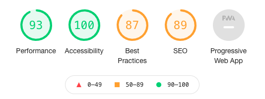
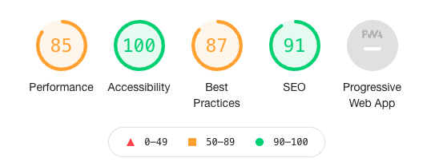
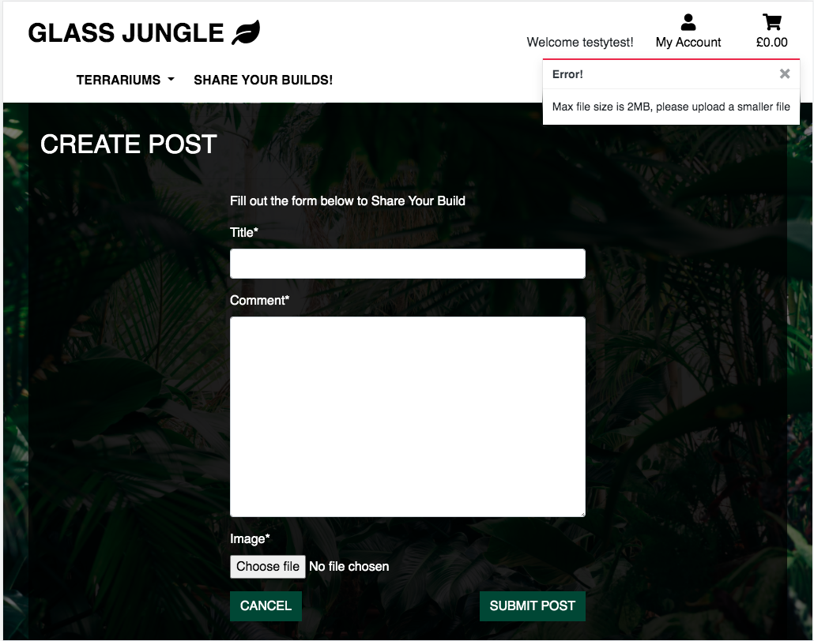
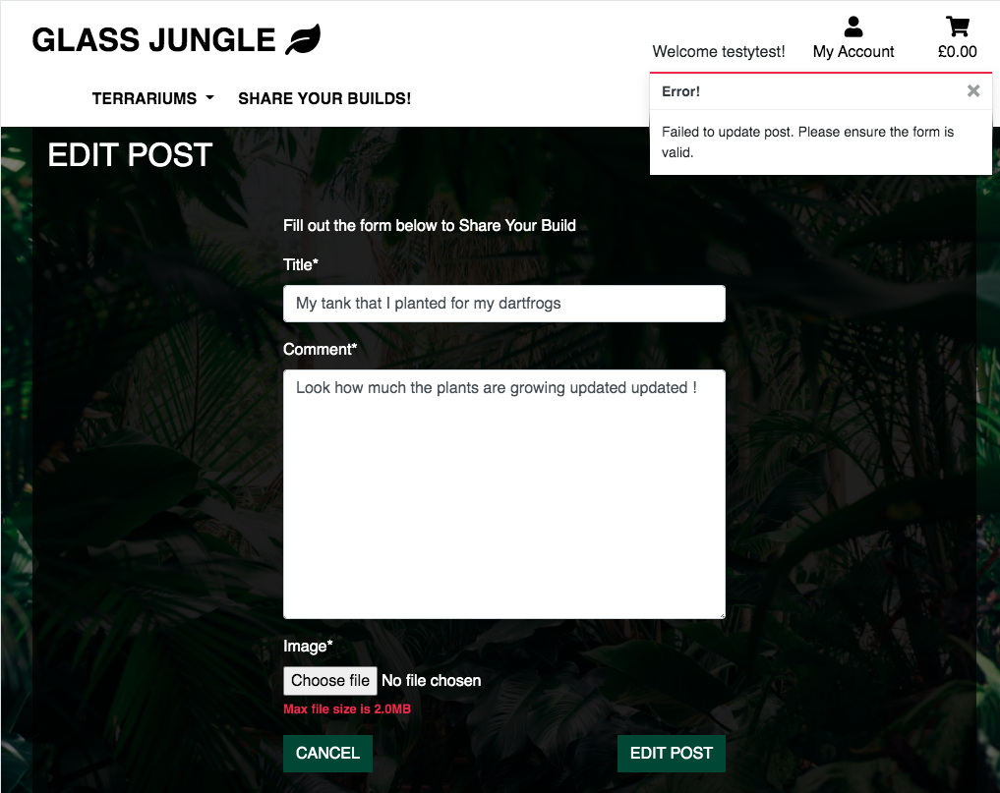

# Testing
<a href="#">Main README.md</a>

I used <a href='https://validator.w3.org/'>Markup Validator Service</a>, <a href="https://jigsaw.w3.org/css-validator/">CSS Validator</a> and <a href='http://pep8online.com/'>PEP8 Online</a> to check the HTML, CSS and Python  I have written for any errors. Those areas that flagged errors I amended the code to make sure it met the validators requirements. 

I used Chrome's inspect feature Lighthouse to check my sites performance on both desktops and mobile devices. 

As you can see from the image the desktop results scored well with a 93 on Performance and 100 on Accessibility. Best Practices scored 87 which is still a good score. Lighthouse has made comment to the fact it suggests I have used front-end Javascript libraries with known security vulnerabilities. When I investigated this further I leaned its making reference to JQuery. Lighthouse suggests the severity is medium, so further investigation on how to combat this in the future is needed. SEO scored 89 so little higher than Best Practices. However, should I want to improve this score I could add meta descriptions to the site. This will make the site appear more relevant and should increase the sites search traffic on search engines. 

As you can see from the mobile results, the site scored well with 100 Accessibility and 91 on SEO. Scored slightly low with 85 on performance and that's down to the large background image I've used across the site. It effects the load up time and according to Lighthouse makes the site sluggish on some mobile devices with limited processing. To improve this score in the future I could look to compress the image file, making it load faster and improve the sites performance. Finally the site scored 87 on Best Practices, once again Lighthouse made reference to the same Javascript libraries security vulnerabilities that it reported in the Desktop test. Once again its worth investigating this to try and avoid any issues moving forward. s

## Testing client Requirements featured in README
* **We need the platforms aesthetics to connect with the companies key demographic**
I did a great deal of research into the clients demographic by visiting sites of there competitors to see how they connect with the demographic. From the research I found that the demographic wanted to connect with nature, and recreate that in there living spaces. I felt that using a high resolution image of a Rainforest as the body's background throughout the site would tap into that need of connection to nature. I then used a colour palette across the site that complimented that background image. 

* **We need a platform that succinctly explains who we are and the function of the company.**
The home page is the first page a user will arrive at, in the center of that home page is an "About Us" section that explains succinctly the function of the clients company. 

* **We need a platform that succinctly explains how to navigate across the site, no matter the device used to view the site.**
The navigation bar is fixed at the top of the page no matter the device the user is using to view the site. As a result within a few clicks the user knows that the navigation can always be found at the top of the page. In addition the navigation is the only area of the site with a white background and black text. Subconsciously the user associates this colour combination with the navigation of the site.

* **We need a platform that allows those visiting to register an account with us.**
There are a number of ways for the user to register an account on the site. I've included a link on the home page, to entice first time visitors of the site to register. In addition should a user find there way onto the log in page and hasn't actually registered, then a description "if you have not created an account yet, then please sign up first" is featured on the page and the words "sign up" act as a link to the register page. Thirdly should a user click the "My Account" link on the top right hand corner of the navigation bar and are not logged in then the drop down has a link called "Register". 

* **We need a platform that allows those who have registered an account to log in and log out freely**
There are a number of ways for a user who has already registered to log into and log out of their account. Firstly, their is a link on the home page that directs those who have registered an account to log in. In addition if a user has yet to log in then the "My Account" link on the top right hand corner of the navigation bar will have "Log In" in its drop down. If the user is logged in and wants to log out then they can go back to the "My Account" link on the top right hand corner of the navigation bar. In its drop down menu they will see "Log Out" once clicked they will be asked if they want to log out, once confirmed a success toast message will appear just below the right hand corner of the navigation bar confirming the user has successfully logged out. 

* **We need a platform that allows those who have registered to leave reviews of products.**
I've created a function which will allow those users who have registered an account to leave a review with a rating on a product. They will be prevented from leaving more than one review, but they will be able to edit or delete said review. 

* **We need a platform that allows those who have registered to share an image and a description of there own terrarium builds**
I've created a a feature of the site called "Share Your Builds", which allows those users with a registered account to upload an image of their builds, with a brief description of the image itself. 

* **We need a platform that allows users to purchase product**
I've built a number of apps within the project that allows registered and non registered users to view all of the product avalaible on the site, add product they want to purchase to a cart, amend that cart, progress the cart to the checkout and purchase and place an order for those items. 

* **We need a platform that notifies registered users of their previous purchase history.**
Providing a user has registered an account once they have logged in if they go to the "My Account" link on the top right hand corner of the navigation bar and click the icon the drop down should appear with "Profile" in it. The user can click the "Profile" link and be transported to their Profile page. The page will display there shipping information on left hand side (that can be amended) and their purchasing history on the right. They can click any order number and that will open a summary of the order. However, the user has to purchase product logged into there account, if they aren't logged in when they purchase then that purchase won't appear in there history. 

## Testing User Stories from UX section in README
### Testing First Time Visitor Goals

 1. <b>As a First Time Visitor, I want to easily understand the main purpose of the site, and learn more about the company.</b>
 * The "About Us " section on the home page features 3 paragraphs explaining the companies values. 
 
 2. <b>As a First Time Visitor, I want to be able to easily navigate through the site to find key content.</b>
 * At the top of each page is a navigation bar that runs the length of the page. It's fixed at the top of the page and allows the visitor, no matter where they are on the website, to know the location of the navigation bar.

3. <b>As a First Time Visitor, I want to clearly find out how to register for an account.</b>
* There are a number of ways for the user to register an account on the site. To entice first time visitors of the site to register, I've included a link on the home page. The user will see a large heading that says "Want to register an account?", with a paragraph on why they should register an account and a link which takes them to the register page.

4. <b>As a First Time Visitor, I want to be able to find out what products the site offers.</b>
* To keep things simple the client has divided there product portfolio into three categories "Empty Terrariums", "Full Terrariums" and "Terrarium Accessories".  At the top of the home page are three large buttons that allow the user to navigate to three pages associated with the three main product categories. This helps the user start there transaction journey with as little clicks as possible. Alternatively on the navigation bar is a drop down list entitled "Terrariums". Once clicked a drop down list appears with all three product categories appearing. The user is then able to click which one they are interested in, and then they are transported to pages associated with these categories and the products within said category. 

5. <b>As a First Time Visitor, I want to be able to choose what product I want and complete a transaction.</b>
* Assuming the user has followed the journey discussed in point 4. they will have reached a product category page. This page will display all of the products associated with said category. If the user is interested in anyone of these products they can click on the image of the product that interests them. This will take them to a product detail page. An image of the product they are interested in will appear, along with a description and an opportunity to either return to the home page and continue there journey through the site, or add that product to the cart. They can even increase or decrease how many of these products they may want to purchase. Once added to the cart, the user can click on the cart icon at the top right hand corner of the navigation bar at the top of the page. Once on the cart page then can click the "Go To Secure Checkout" button to complete there transaction. 

### Testing Returning Visitor Goals

1.  <b>As a Returning Visitor, I want to be able to log into my account quickly.</b>

* As mentioned covering previous visitor goals towards the bottom of the home page there is a link that directs those who have registered an account to log in. In addition if a user has yet to log in then the "My Account" link on the top right hand corner of the navigation bar will have "Log In" in its drop down. The navigation bar is fixed to the top of the page, and so returning users will know exactly where to go in order to log in. 

2.  <b>As a Returning Visitor, I want to be able to register an account if not already.</b>
* There are a number of ways for the user to register an account on the site. I've included a link on the home page, which main function it to entice first time visitors of the site to register. If a returning vistor over looks this link then they can utilise it in order to register an account. In addition should a user find there way onto the log in page and hasn't actually registered, then there is a link to the register page. Thirdly should a user click the "My Account" link on the top right hand corner of the navigation bar and are not logged in then the drop down has a link called "Register".

3.  <b>As a Returning Visitor, I want to be able to visit my profile easily.</b>
* At the top of every page no matter the location on the site the navigation bar is fixed to the top. No matter the device screen the "My Account" Icon is visible. A user can click the "My Account" which activates a drop down. If the user is yet to log in or register there are links for them to do that. Assuming the user is logged in then a "Profile" link will appear. Once clicked the user is transported to there profile page. 

4. <b>As a Returning Visitor, I want to be able to leave a review on a product easily.</b>
* Assuming the user is logged in they can leave a review on a product relatively easy. Quickest route to leaving a review is  clicking one of the three large buttons on the home page, that have the titles "Empty Terrariums", "Full Terrariums" and "Terrarium Accessories". By clicking one of these call to action buttons the user will be transported to the product category page associated with that button. They can click on the image of one of the products that catches there interest, transporting them to that products product detail page. Once there they can scroll down to the bottom of the page to the "Customer Review" section. They can click the "LEAVE A REVIEW" button. Providing they haven't already left a review they will be able to fill out the review form. Providing they have filled out the form correctly once they click "ADD REVIEW" then the review is uploaded to that product.  

5. <b>As a Returning Visitor, I want to be able to leave a post on the community section of the site easily.</b>
* I wanted to allow users with registered accounts to post on the Share Your Builds section of the site. No matter where the user is on the site a link to the "Share Your Builds" section appears on the navigation bar at the top of the screen. If the user is on a device with a smaller screen the main navigation will toggle down to a remote view navigation. However once the user clicks the toggle icon the link to "Share Your Builds" will appear. Once on the "Share Your Builds" page the user (needs to be logged in) can scroll to the bottom of the page and click the "CLICK TO SHARE YOUR BUILDS" button. They will then be transported to a create post form, once filled out correctly they can click the "SUBMIT POST" button and there post will be uploaded to the "Share Your Builds" section. 

### Testing Frequent Visitor Goals

1.  <b>As a Frequent User, I want to be able to see my previous purchase history.</b>

* Providing the user has purchased product while logged in then there purchase history will appear in there profile. Quickest way to log in would be to travel up to the right hand corner of the navigation bar and click the "My Account" icon. This icon will appear in the same location no matter the device screen size the user is using. Once clicked a drop down will appear with "Log In" as an option. Once clicked the user will be prompted to log in. Once logged in the user can go back to the "My Account" icon, click it and in the drop down "My Profile" will appear. Clicking this will transport the user to there profile, and on the right hand side of the page will be there order history. 

2.  <b>As a Frequent User, I want to be able to edit or delete my product reviews.</b>
* Assuming the user is logged in then when they visit any product detail page on the site an "EDIT REVIEW" and "DELETE REVIEW" button will appear next to there product reviews. If the user clicks the "EDIT REVIEW" button they will be transported to a page with a form pre filled with information from that review.  They can amend the information on the form, and click the "UPDATE REVIEW" button. They will be transported back to the product detail page, a toast success message will appear confirming the review has been updated and the review will be updated. Alternatively, if they want to delete the review they can click the "DELETE REVIEW" button. They will be transported to a page that asks them to confirm the decision. If they click "YES" then a toast success message will appear confirming the review is deleted and the review will have been deleted.   

3.  <b>As a Frequent User, I want to be able to edit or delete my posts from the community section of the site.</b>
* Providing the user is logged in, when the visit the "Share Your Builds" section then an "EDIT POST" and "DELETE POST" button will appear underneath each post. If the user clicks the "EDIT POST" button they will be transported to a page with a form pre filled with information from that post.  They can amend the information on the form, and click the "UPDATE POST" button. They will be transported back to the "Share Your Builds" page, a toast success message will appear confirming the post has been updated and the post will be updated. Alternatively, if they want to delete the post they can click the "DELETE POST" button. They will be transported to a page that asks them to confirm the decision. If they click "YES" then a toast success message will appear confirming the post is deleted and the post will have been deleted.   

4. <b>As a Frequent User, I want to be able to edit or amend by default delivery information on my profile.</b>
* Assuming the user in logged in they can go up to the "My Account" icon and once clicked a drop down will appear. One of the options in the drop down menu  will be "My Profile", which the user needs to click. Once clicked they will be transported to there profile page. On the left hand side of the page will be their "Default Delivery Information". If they have made a transaction on the site then the delivery information they have used will fill this form. Alternatively, they form will be empty.  If they fill out the form or amend the information already present, click the "UPDATE INFORMATION" button then their "Default Delivery Information" will be updated.

## Unit Testing Website Features
For extensive testing of the websites features please visit the Manually Testing Website Features section of this document. However, I wanted to display some unit testing using Django's built in testing facility. Given the time constraints for this project I elected not to concentrate on this method of testing, as it can become extremely extensive. Instead I chose to focus on writing manual tests for this TESTING.md document as I felt it a better method of testing for the functions I have build for this project.

Type `python3 manage.py test rating` into the terminal, it will return the results for two tests that I have written. These tests can be found within `test.py` within the rating app of my Glass Jungle project. The first test entitled "test_create_rating_form_valid", tests whether the form submits properly when both the comment and rating fields are filled out correcting. The second test entitled "test_comment_error_returned" tests to see whether the form returns an error when the comment field hasn't been filled out and the form has been submitted. You should see `..` in the terminal denoting that both tests have come back successful. 

Once again please read the Manually Testing Website Features section within this document in order to test the websites features extensively. 

## Manually Testing Website Features
To conduct the following tests an active email address will be required. A number of forms across the site once successfully submited will require you to follow links the site has emailed you. I would suggest either registering a new email address for these tests via gmail, or use <a href="https://temp-mail.org/en/">Temp Mail </a>
### Navigation
* Load the Website. 
* Right click and select inspection. 
* Change the screen size from desktop to tablet, then change from tablet to smaller devices and verify that the navigation bar is responsive. 
* Confirm that the text in the navigation buttons and drop downs are unrestricted by differing screen sizes. 
* Verify that small screen sizes activate the toggle feature. activating the navigation bar remote view nav button. 
* Click each link in turn and confirm that you are transported to the relative section of the website. 
* Confirm that the hover function is operational
* Confirm that the focus function is operational after link has been clicked. 
* Return to the desktop view and hover over the navigation links, make sure the hover selection function works for each link. 
* Clock each link and make sure the focus function is operational, and make sure you are transported to the correct section of the site. 
* Repeat verification of functionality and responsiveness on iPhone and iPad. 

### Home 
* Load the Website. 
* Right click and select inspection.
* Scroll down the page to three large call to action buttons, directing you to the three key product categories. 
* Change screen size from desktop to tablet, then change from tablet to smaller devices and verify text and buttons remain visible and unrestricted. 
* Hover over each button and confirm that the hover function is working properly. 
* Scroll down the page to the "About Us" section. 
* Repeat steps above for changing screen sizes, to check section's responsiveness. Text should remain visible and be unrestricted. 
* Scroll down the page to the "Register and Login account" sections. 
* Repeat steps above for changing screen sizes, to check section's responsiveness. Text and buttons should remain visible and be unrestricted.
* Hover over each button and confirm that the hover function is working properly.
* At this point you should log into your account, for update on how to do this scroll down below to the register or login manual tests. 
* Once logged in scroll down to the bottom of the page, and confirm that the "Register and Login account" sections aren't visible anymore. 

### Register
#### Testing Links to Sign Up Page
* Load the Website. 
* Scroll down the page to the "Want to register an account?" section. 
* Hover over the "Register An Account!" call to action button and verify that the hover function works.
* Click the "Register An Account!" call to action button, verify the focus function works correctly. 
* You should be transported to the "Sign Up" page. 
* Click the "GLASS JUNGLE" company logo in the top of the navigation bar, should be transported back to the home page. 
* Click the "My Account" icon on the navigation bar, a drop down should appear. 
* Click "Register" and confirm that the focus function works after the link is clicked. 
* You should be transported to the "Sign Up" page. 

#### Testing Sign Up Function 
* Navigate to the Sign Up Page. 
* Right click and select inspection.
* Toggle between different device screen sizes and confirm that text and buttons remain visible and unrestricted.
* Click "BACK TO LOGIN", confirm the focus function is operational, should be transported to "Sign In" page. 
*  Click the "sign up" link in the description of the "Sign In" form to be transported back to the "Sign Up" page. 
* Click "SIGN UP" call to action button, should be reminded to fill in the "E-mail address" input. 
* Input the email address you are choosing to conduct these manual tests into the "E-mail address" input. 
* Click "SIGN UP" call to action button, should be reminded to fill in the "E-mail address confirmation" input. 
* Input the email address you are choosing to conduct these manual tests into the "E-mail address confirmation" input. 
* Click "SIGN UP" call to action button, should be reminded to fill in the "Username" input. 
* Input a three letter word of your choice and click "SIGN UP" call to action button, should get a error "Please lengthen this text to 4 characters or more (you are currently using 3 characters)." 
* Input a username longer than 4 characters in length and click the "SIGN UP" call to action button. You should be reminded to fill in the "Password" input.
* Input a password and  click "SIGN UP" call to action button, should be reminded to fill in the "Password (again)" input.
* Input a different password into the "Password (again)" input, and  click "SIGN UP" call to action button. 
* The form won't submit, the "Password (again)" input will have a red outline and a error message underneath it saying "You must type the same password each time."
* Input the same password into both the "Password" and "Password (again)" inputs, and  click "SIGN UP" call to action button. 
* The "VERIFY YOUR EMAIL ADDRESS" page will appear notifying you that you have been emailed a confirmation email. 
* A alert toast message will appear on the top right hand corner page saying "Confirmation e-mail sent to YOUREMAIL". 
* Go to the inbox of the email address you used to register an account, you should see the verification email from Glass Jungle. 
* Copy the link from that email into your browser. 
* The link will have taken you to the "CONFIRM E-MAIL ADDRESS" page, you should see a message that says "Please confirm that YOUREMAIL is an e-mail address for user USERNAME. Click the "Confirm" call to action button. 
* A success toast message will appear on the top right hand corner of the page saying "You have confirmed YOUREMAIL". 
* You will also be on the Sign Up page. 
* Fill in the email address you just registered an account with into the "Username or e-mail" text input, and input the password. 
* Click the "SIGN IN" call to action button. 
* You will now be at the Home page, signed into your account. 
*   A success toast message will appear on the top right hand corner page saying "Successfully signed in as USERNAME".
* In the navigation bar "Welcome USERNAME!" will have appeared next to the "My Account" icon confirming you have successfully logged in. 

### Login
####  Testing Links to Sign In Page
* Load the Website. 
* Make sure you are logged out, if you are unsure how to do that scroll down to the manual checks associated with logging out of your account. 
* Scroll down the page to the "Already have an account?" section. 
* Hover over the "Login to your Account" call to action button and verify that the hover function works.
* Click the "Login to your Account" call to action button, verify the focus function works correctly. 
* You should be transported to the "Sign In" page. 
* Click the "GLASS JUNGLE" company logo in the top of the navigation bar, should be transported back to the home page. 
* Click the "My Account" icon on the navigation bar, a drop down should appear. 
* Click "Login" and confirm that the focus function works after the link is clicked. 
* You should be transported to the "Sign In" page. 

#### Testing Sign In Function 
* Navigate to the Sign In page. If you have issues doing this make sure you are logged out of your account. If you are unsure how to do that scroll down to the manual checks associated with logging out of your account. 
* Right click and select inspection.
* Toggle between different device screen sizes and confirm that text and buttons remain visible and unrestricted.
* Click "HOME", confirm the focus function is operational, should be transported to "Home" page. 
*  Go to the "My Account" icon and click to activate the drop down menu, click "Login" to be transported back to the Sign Up page. 
* Click "SIGN IN" call to action button, should be reminded to fill in the "Username or e-mail address" input. 
* Fill in the "Username or e-mail address" input with the email address you used to register an account with, and click "SIGN IN" call to action button. 
* A reminder to fill out the "Password" input should appear, fill in the "Password" input with the wrong password and click "SIGN IN" call to action button. 
* An error message will appear saying "The e-mail address and/or password you specified are not correct." Fill in the "Password" input with correct password and click "SIGN IN" call to action button. 
* A success toast message will appear on the top right hand corner of the page saying "Successfully signed in as USERNAME". 
* You will be transported back to the home page, in the navigation bar "Welcome USERNAME!" will have appeared next to the "My Account" icon confirming you have successfully logged in. 
* Go to the "My Account" icon and click to activate the drop down menu, click "Logout". 
* Go back to the "My Account" icon and click to activate the drop down menu, click "Login". 
* Fill out the "Username or e-mail" input with a random name. 
* Input the correct "Password" into the password input, and click the "SIGN IN" call to action button.
* You will get an error message saying "The username and/or password you specified  are not correct". 
* Input your username into the the "Username or e-mail" input. 
* In the "Password" input type the incorrect password and click the "SIGN IN" call to action button.
* You will get an error message saying "The username and/or password you specified  are not correct". 
* Input your username into the the "Username or e-mail" input. 
* Input the correct password into the "Password" input and click the "SIGN IN" call to action button.
* A success toast message will appear on the top right hand corner of the page saying "Successfully signed in as USERNAME". 
* You will be transported back to the home page, in the navigation bar "Welcome USERNAME!" will have appeared next to the "My Account" icon confirming you have successfully logged in. 

### Logout
####  Testing Sign Out Function
* Load the Website. 
* Make sure you are logged in to you account. If you are unsure how to do that scroll down to the manual checks associated with logging in to your account. 
* Go to the "My Account" icon and click to activate the drop down menu, click "Logout". 
* You should be transported to the "Sign Out" page. 
* Change the screen size from desktop to tablet, then change from tablet to smaller devices and verify that the navigation bar is responsive. 
* Click the "CANCEL" call to action button to be transported back to the "Home" page. 
* Go to back to the "My Account" icon and click to activate the drop down menu, click "Logout". 
* You should be transported to the "Sign Out" page. 
* Click the "SIGN OUT" call to action button. 
* A success toast message will appear on the top right hand corner of the page saying "You have signed out".
* You will be transported back to the home page, in the navigation bar you will no longer see "Welcome USERNAME!"  next to the "My Account" icon. This confirms you are no longer logged into your account.

### Forgot Password
#### Testing Links to Password Reset Page
* Load the Website. 
* Make sure you are logged out, if you are unsure how to do that scroll down to the manual checks associated with logging out of your account. 
* Go to the "My Account" icon and click to activate the drop down menu, click "Login" to be transported to the "Sign In" page. 
* Click the link entitled "Forgot Password?". 
* You should be on the "Password Reset" page. 

#### Resting Password Reset Function 
* Load Website
* Make sure you are logged out, if you are unsure how to do that scroll down to the manual checks associated with logging out of your account. 
* Follow steps in "Testing Links to Password Reset Page" to get to the "Password Reset" page. 
* Once at the "Password Reset" page click the "Back to Login" call to action button. Make sure that the focus function is working correctly, and you will be transported back to the "Sign In" page. 
* Click the link entitled "Forgot Password?", to be transported back to the Password Reset Function. 
* Click the "Rest My Password" call to action button, you should be prompted with a reminder to fill in the "E-mail address" field.
* Input an random email address into the  "E-mail address" field, would suggest `random@randomemail.com` and click the "Rest My Password" call to action button. 
* The form won't submit and an error will appear. A red outine will surround the "E-mail address" field and an error message will appear saying "The e-mail address is not assigned to any user account". 
* Input the email address you used to register an account and click the "Rest My Password" call to action button. 
* A message will appear saying" We have sent you an e-mail. Please contact us if you don not receive it within a few minutes". 
* Go to your email inbox and you should see an password rest email from Glass Jungle. 
* Copy the link in the email into your browser, you will be transported to the "Change Password" page. 
* Click the "Change Password" call to action button, you should get a reminder saying "Please fill in this field underneath the "New Password" field. 
* Input a password into the "New Password" field, and click the "Change Password" call to action button, a reminder will appear saying "Please fill in this field underneath the "New Password (again)" field.
* Input a different password to the one inputed in the "New Password" field in the "New Password (again)" field and click the "Change Password" call to action button. 
* The form won't submit correctly, the border of the "New Password (again)" field will become red and an error message saying  "You must type the same password each time" will appear. 
* Input a the same 4 letter password into both the "New Password" field and "New Password (again)" field and click the "Change Password" call to action button. 
* The form won't submit correctly, the border of the "New Password" field will become red and two error messages "This password is too short. It must contain at least 8 characters." and "This password is too common".  will appear. 
* Input a the same 8 letter password with numbers and letters into both the "New Password" field and "New Password (again)" field and click the "Change Password" call to action button. 
* A success toast message will appear on the top right hand corner of the page saying "Password successfully changed". In addition you will be transported to the "Change Password" page. 
*  Click the "My Account" icon on the navigation bar, a drop down should appear. 
* Click "Login" and confirm that the focus function works after the link is clicked. 
* You should be transported to the "Sign In" page. 
* Input your email address into the "Username or e-mail" field and your new password into the "Password" field and click the "SIGN IN" call to action button. 
* A success toast message will appear on the top right hand corner of the page saying "Successfully signed in as USERNAME". 
* You will be transported back to the home page, in the navigation bar "Welcome USERNAME!" will have appeared next to the "My Account" icon confirming you have successfully logged in. 

### E-Commerce 
#### Testing Adding Items to Cart
* Load the Website.
* You can be logged into an account or logged out for this test.
* Right click and select inspection.
* Toggle between different device screen sizes and confirm that text and buttons remain visible and unrestricted.
* Go up to the navigation bar and click on the "Terrariums" drop down, and click one of the product categories. 
* You will now be on one of the three product category pages on the site. Click on one of the product images. 
* You will have now been transported to that products product detail page. 
* Toggle between different device screen sizes and confirm that text and buttons remain visible and unrestricted.
* Hover over all of the buttons on the page and make sure that the hover functions work. 
* You will notice that there is a "Quantity" section, click the "-" icon, the icon will go grey and won't let you go below 0. 
* Click the "ADD TO CART" call to action button. 
* A success toast message will appear on the top right hand corner of the page saying "Success!". You will also see an summary of your cart, image, name and price of the product you have added to the cart. In addition the cart icon will have changed colour to a dark green and the total figure be positioned just underneath that icon. 
* Go back up to the navigation bar and click on the "Terrariums" drop down, and click another one of the product categories you didn't click last time.
*  You will now be on one of the three product category pages on the site. Click on one of the images of the product. 
* You will have now been transported to that products product detail page. 
* Test increase quantity feature of the "Quantity" section, buy clicking the "+" icon to increase quantity of the purchase product. 
* Click the "ADD TO CART" call to action button. 
* A success toast message will appear on the top right hand corner of the page saying "Success!". You will also see an summary of your cart, image, name and total price of all the products you have  added to the cart up until this point. The cart icon will still be dark green, but the figure underneath it will have increased to match the cart total.  
* Hover over the "GO TO CART" call to action button to confirm the hover function works. 
* Click the "GO TO CART" call to action button. 
* You should now be on cart page with the title "Welcome To Your Cart" confirming that fact. 
* All of the products you have added should appear in the cart summary table. 
* Toggle between different device screen sizes and confirm that text and buttons remain visible and unrestricted.
* Go up to the company logo on the top left hand corner of the page in the navigation bar and click "GLASS JUNGLE". 
* You should arrive at the home page. 
* To test another one of the links to the cart page go to the top left hand corner of the page and hover over the cart icon to confirm the hover function works. 
* Click the cart icon, and you should be transported back to your cart page. 
* Scroll down the page, the subtotals within the cart summary once added together should equal the same figure thats next to "Grand Total:" at the bottom of the page. 
* Hover over "KEEP SHOPPING" call to action button, to confirm the hover effect works. 
* Click "KEEP SHOPPING" to be transported back to home and confirm the button function. 

#### Testing Amending Items within your Cart
* Load the Website.
* You can be logged into an account or logged out for this test.
* Follow all of the steps found in **Testing Adding Items to Cart**. 
* Providing you have followed the previous steps you should now find yourself on the cart page, with some products added to a cart. 
* Within the cart summary you should see a similar quantity section to that found on the sites product details page, this time labelled "Qty". Click the "-" icon, the "-" icon won't let you go below 1.
* Click the "+" icon to increase the quantity of said product in your cart. 
* Click the "Update" call to action button just below the quantity selector. 
* A success toast message will appear on the top right hand corner of the page saying "Success!". You will also see an summary of your cart, as before. In addition, the total will have been amended to match the quantity update you just made. In addition the total just under the cart icon in the navigation bar  will have increased. 
* Click "X" in the top right hand corner of the toast to close it. 
* Look at the subtotal for the product you have just amended, the subtotal should equal the price per unit multiplied by the quantity. 
* Just below quantity selector is the "Remove" call to action button, click this button. 
* A success toast message will appear on the top right hand corner of the page saying "Success!". You will also see an summary of your cart, as before but the total will have been amended to match the removal of the product. The total figure positioned just underneath the cart icon will have decreased by the price of the product you just removed.
* Repeat the removal process until you have nothing left in your account. 
* After the final product has been removed, a success toast message will appear on the top right hand corner of the page saying "Success! Removed PRODUCT NAME from your cart"
* The cart page will no longer have cart summary, instead it will say "Your cart is empty" in the centre of the page. 
*  Hover over "KEEP SHOPPING" call to action button, to confirm the hover effect works. 
* Click "KEEP SHOPPING" and you will be transported back to the home page. 

#### Testing Checkout Function Not Logged In
* Load Website
* Make sure you are logged out, if you are unsure how to do that search for the  manual checks associated with logging out of your account within this document.
* Follow all of the steps found in **Testing Adding Items to Cart**.
* At this point you should be on the cart page and have some items in your cart.
* Scroll down the page and hover over the "SECURE CHECKOUT" call to action button, to confirm the hover function works. 
* Click the "SECURE CHECKOUT" call to action button, the focus function should work and you should be taken to the checkout page. 
* On the right hand side of the page you should see a order summary matching the cart summary on the previous cart page. On the left hand side of the page will be the delivery details. 
* Scroll down the page and hover over the "COMPLETE ORDER" call to action button to confirm the hover function is working. 
* Click the "COMPLETE ORDER" call to action button, a prompt reminding you to fill out the "Full Name" field will appear. 
* Fill out the "Full Name" field, scroll down the page and click the "COMPLETE ORDER" call to action button, a prompt reminding you to fill out the "Email Address" field will appear. 
* Fill out the "Email Address" field using the active email address. Doesn't have to be but for ease I would use the email address you have used throughout these manual tests and click the "COMPLETE ORDER" call to action button, a prompt reminding you to fill out the "Phone Number" field will appear.
*  Fill out the "Phone Number" field and click the "COMPLETE ORDER" call to action button, a prompt reminding you to fill out the "Street Address 1" field will appear.
* Fill out the "Street Address 1" field and click the "COMPLETE ORDER" call to action button. You won't get a prompt reminding you to fill out the "Street Address 2" , as it doesn't have a star next to it. Thus it isn't required in order to submit the form correctly. However, you will get a prompt reminding you to fill out the "Town or City" field will appear.
* Fill out the "Town or City" field and click the "COMPLETE ORDER" call to action button. You won't get a prompt reminding you to fill out the "County" or "Postal Code" fields , as both fields don't have a star next to them and aren't required in order to submit the form correctly. However, you will get a prompt reminding you to fill out the "Country" field.
* Click on the "Country" field and select the country you are delivering too. Once selected click the "COMPLETE ORDER" call to action button. A sync icon will appear spinning on the screen, and suggests the form is trying to submit. However, because you didn't fill out the payment information the form won't submit. Instead an error message will appear and say "Your card number is incomplete". 
* Input `1234 1234 1234 1234` into to "Payment" field in order to test the built in Stripe validation. An error message should appear saying "Your card number is invalid"
* Input `4242 4242 4242 4242 04/24 242 42424` into the "Payment" field and click the "COMPLETE ORDER" call to action at the bottom of the page. 
* A sync icon will appear spinning on the screen as the form is processed. You will arrive at the checkout success page, thanking you for the order and telling you that a confirmation email will be sent to the email you used to process the payment. 
* A success toast message will appear on the top right hand corner of the page saying "Success!, Order successfully purchased! Your order number is ORDER NUMBER. A confirmation email will be sent to EMAIL ADDRESS".
* Go to the inbox of the email address you used in this test, you will have received a confirmation email confirming the purchase has been successful and is complete. 
* Go back to the website scroll down to the "BACK TO HOME" call to action button, hover over it to confirm the hover function is working. 
* Click the "BACK TO HOME" call to action button, confirming focus function works and you will be taken to the home page. 

#### Testing Checkout with Checkout Log In Function
* Load Website
* Make sure you are logged out, if you are unsure how to do that search for the  manual checks associated with logging out of your account within this document.
* Follow all of the steps found in **Testing Adding Items to Cart**.
* At this point you should be on the cart page and have some items in your cart.
* Scroll down the page and hover over the "SECURE CHECKOUT" call to action button, to confirm the hover function works. 
* Click the "SECURE CHECKOUT" call to action button, the focus function should work and you should be taken to the checkout page. 
* On the right hand side of the page you should see a order summary matching the cart summary on the previous cart page. On the left hand side of the page will be the delivery details.
* Scroll down the page and just below the "Delivery" fields should be a link that says "Login", hover over that link to make sure the hover function works. 
* Click "Login" and you should be taken to the "Sign In" page. 
* Fill out the "Username or e-mail" field with the email address you have already used to register, and fill out "Password" field with the password used to register that account. 
* You will be taken back to the home page, this time you are logged in. On the navigation bar "Welcome USERNAME!" will have appeared next to the "My Account" icon confirming you have successfully logged in. A success toast message will also appear on the top right hand corner of the page saying "Success!". You will also see an summary of your cart, image, name and total price of all the products you have added to the cart up until this point. The cart icon will still be dark green, but the figure underneath it will be the cart total.
* Scroll up to the toast and scroll over the "GO TO CART" call to action button and confirm the hover function works. 
* Click the "GO TO CART" call to action button and you will be taken to the cart page. 
* Scroll down the page click the "SECURE CHECKOUT" call to action button, the focus function should work and you should be taken to the checkout page. 
* Having just logged in, the "E-mail" field on the left hand side of the checkout page in the details section will be pre-filled with the email address associated with the account you just logged into. 
* Fill out the delivery fields as you did during the **Testing Checkout Function Not Logged In** manual tests. 
* Just below the delivery fields there is a "Save this delivery information to my profile" checkbox. Make sure this checkbox is clicked to test this function. 
* Scroll down to the payment field and fill it out with the following `4242 4242 4242 4242 04/24 242 42424` and then click the "COMPLETE ORDER" call to action at the bottom of the page. 
* A sync icon will appear spinning on the screen as the form is processed. You will arrive at the checkout success page, thanking you for the order and telling you that a confirmation email will be sent to the email you used to process the payment. In addition a complete summary of your order will appear in a table just below this message. 
* A success toast message will appear on the top right hand corner of the page saying "Success!, Order successfully purchased! Your order number is ORDER NUMBER. A confirmation email will be sent to EMAIL ADDRESS".
* Go to the inbox of the email address you used in this test, you will have received a confirmation email confirming the purchase has been successful and is complete. 
* Go back to the website scroll down to the "BACK TO PROFILE" call to action button, hover over it to confirm the hover function is working. 
* Click the "BACK TO PROFILE" call to action button, the focus function will work and you will be taken to your accounts profile page. 
* On the page you will see the pages title saying "My Profile" denoting that you are on your profile page. 
* On the left hand side of the profile page the fields within the "Default Delivery Information" section will be pre-filled with the information you just filled out during the transaction above, this confirms the "Save this delivery information to my profile" function is working. 
* On the right hand side of the profile page is the "Order History" section, and the transaction you just placed should appear, with the date, items from the order and the order total. 
* Hover over the order number for this order to confirm the hover function works. 
* Click the order number and you will be taken to the success page for that order. 
* Scroll down and click the "BACK TO PROFILE" call to action button to go back to your profile. 

#### Testing Checkout with Checkout Register Function
* Load Website
* Make sure you are logged out, if you are unsure how to do that search for the  manual checks associated with logging out of your account within this document.
* Follow all of the steps found in **Testing Adding Items to Cart**.
* At this point you should be on the cart page and have some items in your cart.
* Scroll down the page and hover over the "SECURE CHECKOUT" call to action button, to confirm the hover function works. 
* Click the "SECURE CHECKOUT" call to action button, the focus function should work and you should be taken to the checkout page. 
* On the right hand side of the page you should see a order summary matching the cart summary on the previous cart page. On the left hand side of the page will be the delivery details.
* Scroll down the page and just below the "Delivery" fields should be a link that says "Create an account", hover over that link to make sure the hover function works. 
* Click "Create an account" and you should be taken to the "Sign Up" page. 
* Follow the manual tests for **Testing Sign Up Function** to setup a new account. 
* Once you have successfully registered and signed into that account you will be taken back to the home page. On the navigation bar "Welcome USERNAME!" will have appeared next to the "My Account" icon confirming you have successfully logged in. A success toast message will also appear on the top right hand corner of the page saying "Success!". You will also see an summary of your cart, image, name and total price of all the products you have added to the cart up until this point. The cart icon will still be dark green, but the figure underneath it will be the cart total.
* Scroll up to the toast and scroll over the "GO TO CART" call to action button and confirm the hover function works. 
* Click the "GO TO CART" call to action button and you will be taken to the cart page. 
* Scroll down the page click the "SECURE CHECKOUT" call to action button, the focus function should work and you should be taken to the checkout page. 
* Having just logged in, the "E-mail" field on the left hand side of the checkout page in the details section will be pre-filled with the email address associated with the account you just logged into. 
* Fill out the delivery fields as you did during the **Testing Checkout Function Not Logged In** manual tests. 
* Just below the delivery fields there is a "Save this delivery information to my profile" checkbox. Make sure this checkbox is clicked to test this function. 
* Scroll down to the payment field and fill it out with the following `4242 4242 4242 4242 04/24 242 42424` and then click the "COMPLETE ORDER" call to action at the bottom of the page. 
* A sync icon will appear spinning on the screen as the form is processed. You will arrive at the checkout success page, thanking you for the order and telling you that a confirmation email will be sent to the email you used to process the payment. In addition a complete summary of your order will appear in a table just below this message. 
* A success toast message will appear on the top right hand corner of the page saying "Success!, Order successfully purchased! Your order number is ORDER NUMBER. A confirmation email will be sent to EMAIL ADDRESS".
* Go to the inbox of the email address you used in this test, you will have received a confirmation email confirming the purchase has been successful and is complete. 
* Go back to the website scroll down to the "BACK TO PROFILE" call to action button, hover over it to confirm the hover function is working. 
* Click the "BACK TO PROFILE" call to action button, the focus function will work and you will be taken to your accounts profile page. 
* On the page you will see the pages title saying "My Profile" denoting that you are on your profile page. 
* On the left hand side of the profile page the fields within the "Default Delivery Information" section will be pre-filled with the information you just filled out during the transaction above, this confirms the "Save this delivery information to my profile" function is working. 
* On the right hand side of the profile page is the "Order History" section, and the transaction you just placed should appear, with the date, items from the order and the order total. 
* Hover over the order number for this order to confirm the hover function works. 
* Click the order number and you will be taken to the success page for that order. 
* Scroll down and click the "BACK TO PROFILE" call to action button to go back to your profile. 

#### Testing Checkout Function Logged In
* Load Website
* Make sure you are logged in to you account. If you are unsure of how to do that search for the  manual checks associated with logging into your account within this document.
* Follow all of the steps found in **Testing Adding Items to Cart**.
* At this point you should be on the cart page and have some items in your cart.
* Scroll down the page and hover over the "SECURE CHECKOUT" call to action button, to confirm the hover function works. 
* Click the "SECURE CHECKOUT" call to action button, the focus function should work and you should be taken to the checkout page. 
* On the right hand side of the page you should see a order summary matching the cart summary on the previous cart page. On the left hand side of the page will be the delivery details. The delivery details field will be pre filled with the "Default Delivery Information" from your profile. In addition the "Email" field will be pre-filled with the email address associated with the account. 
* Fill out the "Full Name" field. 
* Uncheck the "Save this delivery information to my profile" checkbox. 
* Input `1234 1234 1234 1234` into to "Payment" field in order to test the built in Stripe validation. An error message should appear saying "Your card number is invalid"
* Input `4242 4242 4242 4242 04/24 242 42424` into the "Payment" field and click the "COMPLETE ORDER" call to action at the bottom of the page. 
* A sync icon will appear spinning on the screen as the form is processed. You will arrive at the checkout success page, thanking you for the order and telling you that a confirmation email will be sent to the email you used to process the payment. In addition a complete summary of your order will appear in a table just below this message. 
* A success toast message will appear on the top right hand corner of the page saying "Success!, Order successfully purchased! Your order number is ORDER NUMBER. A confirmation email will be sent to EMAIL ADDRESS".
* Go to the inbox of the email address you used in this test, you will have received a confirmation email confirming the purchase has been successful and is complete. 
Go back to the website scroll down to the "BACK TO PROFILE" call to action button, hover over it to confirm the hover function is working. 
* Click the "BACK TO PROFILE" call to action button, the focus function will work and you will be taken to your accounts profile page. 
* On the page you will see the pages title saying "My Profile" denoting that you are on your profile page. 
* On the left hand side of the profile page the fields within the "Default Delivery Information" section will be pre-filled with the last updated delivery information. Because you unchecked the "Save this delivery information to my profile" the the address information won't have been updated from the latest transaction. 
* On the right hand side of the profile page is the "Order History" section, and the transaction you just placed should appear, with the date, items from the order and the order total. 
* Hover over the order number for this order to confirm the hover function works. 
* Click the order number and you will be taken to the success page for that order. 
* Scroll down and click the "BACK TO PROFILE" call to action button to go back to your profile. 

### Profile
#### Testing Profile Page

* Load the Website.
* Make sure you are logged out, if you are unsure how to do that search for the  manual checks associated with logging out of your account within this document.
* Scroll down the page to the "Already have an account?" section.
* Hover over the "Login to your Account" call to action button and verify that the hover function works.
* Click the "Login to your Account" call to action button, verify the focus function works correctly.
* Now on the "Sign In" page fill out the "Username or e-mail" and "Password" fields with the information you used to register an account in the previous manual tests. If you have yet to register an account please go to **Testing Sign Up Function** in this document and follow the steps to register an account. 
*You will be taken back to the home page, and are now logged in. On the navigation bar "Welcome USERNAME!" will have appeared next to the "My Account" icon confirming you have successfully logged in.
* Click the "My Account" icon and a drop down will appear. 
* Click "My Profile" in the drop down menu, a focus function will execute and you will be transported to the profile page. 
* On the page you will see the pages title saying "My Profile" denoting that you are on your profile page. 
* On the left hand side of the profile page the fields within the "Default Delivery Information" section will either be empty because you have yet to update the fields or have yet to complete a purchase logged into your account. Alternatively, the "Default Delivery Information" fields will be pre-filled with the delivery from your first purchase you conducted while logged into your account, or last purchase conducted while logged into your account with the "Save this delivery information to my profile" checkbox on the checkout page engaged. 
* Click the "Country" field drop down menu and change the country from the one you currently have selected to another. 
* Hover over the "UPDATE INFORMATION" call to action button, to confirm the hover function works. 
* Click "UPDATE INFORMATION" call to action button to submit the form. 
* A success toast message will appear on the top right hand corner of the page saying "Success!, Profile updated successfully". The "Default Delivery Information" on the profile will be updated. 
* On the right hand side of the profile page is the "Order History" section, and the previous purchases you made while logged into this account should appear, with the date, items from the order and the order total. 
* Hover over the order number for this order to confirm the hover function works. 
* Right click and open this link onto a different tab on your browser. The Checkout Success page associated with that order will appear, with the order summary of that order. 
* Close the tab. 

### Review
#### Testing Leaving a Review Function
* Load the Website.
* Make sure you are logged out of your account. If you are unsure how to do this please follow the steps from the **Testing Sign Out Function**. 
* At this point you should find yourself on the home page. 
* Go up to the navigation bar and click the "TERRARIUMS" drop down menu, and select "Terrarium Accessories". 
* When you click "Terrarium Accessories" a focus function will execute and you will be taken to the "Terrarium Accessories" product page. 
* Scroll down the page and find the product card for the "Exo Terra Reptile Hiding Cave Small". 
* Click on the image for the "Exo Terra Reptile Hiding Cave Small" you will be transported to the product detail page for the "Exo Terra Reptile Hiding Cave Small".
* Scroll down the page and just below the "KEEP SHOPPING" and "ADD TO CART" call to action buttons you should see "THIS PRODUCT HAS NO REVIEWS". 
* Now log in to your account, or if you have yet to register an account please register an account. If you are unsure how to do either of these processes please follow the manual steps for **Testing Sign In Function** or **Testing Sign Up Function**. 
* You should be back at the home page, follow the steps above to get back to the "Exo Terra Reptile Hiding Cave Small" product info page. 
* Scroll back down the page and just below the "KEEP SHOPPING" and "ADD TO CART" call to action buttons you should see "THIS PRODUCT HAS NO REVIEWS". Now because you are logged in you will see a "LEAVE A REVIEW" call to action button. 
* Hover over the "LEAVE A REVIEW" call to action button to confirm the hover function works. 
* Click the "LEAVE A REVIEW" call to action button and the focus function should execute and you will be transported to the "Review a Product" page. 
* Hover over the "CANCEL" call to action button to confirm the hover function works. 
* Click the "CANCEL" call to action button and the focus function should execute and you will be transported back to the product detail page for the "Exo Terra Reptile Hiding Cave Small". 
* Click the "LEAVE A REVIEW" call to action button to go back to the "Review a Product" page. 
* Hover over the "ADD REVIEW" call to action button to confirm the hover function works. 
* Click the "ADD REVIEW" call to action button and the focus function will execute, the form won't submit. Instead you will see a prompt saying "Please fill in this field" underneath the "Comment" field.  
* Add some text to the "Comment field" and click the "ADD REVIEW" call to action button, the form won't submit. Instead you will see a prompt saying "Please fill in this field" underneath the "Rating" field. 
* Add "-1" in the "Rating" field and click the "ADD REVIEW" call to action button. 
* The form won't submit, a error toast message will appear on the top right hand corner of the page saying "Please rate product between 0 and 5".
* Fill out the "Comment" field again and add "20" to the "Rating" field and click the "ADD REVIEW" call to action button. 
*  The form won't submit, a error toast message will appear on the top right hand corner of the page saying "Please rate product between 0 and 5".
* Fill out the "Comment" field once more and add a number between 0 and 5 in the "Rating" field and click the "ADD REVIEW" call to action button.
* The form will submit,  a success toast message will appear on the top right hand corner of the page saying "Success! Review Successfully added!".
* Scroll down the "Exo Terra Reptile Hiding Cave Small" product detail page. Just below the "KEEP SHOPPING" and "ADD TO CART" call to action buttons you will see the review you just left. You will see your account username, rating out of 5 with star icon, comment from the review, date the review was created, and a date should the review be updated. 

#### Testing Edit a Review Function
* Load the Website
* Firstly you will need to leave a review on a product in order to edit said review. If you are unsure on the process for leaving a review please follow the steps from the **Testing Leaving a Review Function**. 
* Log out of your account. If you are unsure how to do this please follow the steps from the **Testing Sign Out Function**.
* Go to the "Exo Terra Reptile Hiding Cave Small" product detail page (as covered in the steps for **Testing Leaving a Review Function**) and scroll down the page. You should see your review in the "CUSTOMER" REVIEW" section of the product detail page. 
* Now log back into your account, if you are unsure of how to do this please follow the steps from the **Testing Sign In Function**. 
* Go back to the "Exo Terra Reptile Hiding Cave Small" product detail page (as covered in the steps for **Testing Leaving a Review Function**) and scroll down the page. You should see your review in the "CUSTOMER" REVIEW" section of the product detail page. You should see two new call to action buttons now you are signed in labelled "EDIT REVIEW" and "DELETE REVIEW".  
* Hover over the "EDIT REVIEW" call to action button to confirm the hover function works. 
* Click the "EDIT REVIEW" call to action button and the focus function should execute and you will be transported to the "Edit Review" page. The form will be pre-filled with the information from the review you are editing. 
* Hover over the "CANCEL UPDATE" call to action button to confirm the hover function works. 
* Click the "CANCEL UPDATE" call to action button, and you will be transported back to the product detail page for the "Exo Terra Reptile Hiding Cave Small". 
* Click the "EDIT REVIEW" call to action button to go back to the "Edit Review" page. 
*  Amend the text that is already in the "Comment" field, and delete the number in the "Rating" field, add "-1" and click the "UPDATE REVIEW" call to action button.
*  The form won't submit, a error toast message will appear on the top right hand corner of the page saying "Please rate product between 0 and 5". In addition the form will refresh pre-filled with original information from the review. 
* Amend the text that is already in the "Comment field", and delete the number in the "Rating" field. Then add a number between 0 and 5 and click the "UPDATE REVIEW" call to action button.
* You will arrive back at the product detail page for the "Exo Terra Reptile Hiding Cave Small". A success toast message will appear on the top right hand corner of the page saying "Success!, Review Successfully Updated!". Scroll down the page to the "CUSTOMER REVIEW" section and you will see the review with the amendments you have just made. You will also notice that the updated date should match the time and date of when you edited the review.  

#### Testing Delete a Review Function
* Load the Website.
* Firstly you will need to leave a review on a product in order to delete said review. If you are unsure on the process for leaving a review please follow the steps from the **Testing Leaving a Review Function**.
* Then log out of your account. If you are unsure how to do this please follow the steps from the **Testing Sign Out Function**.
* Go to the "Exo Terra Reptile Hiding Cave Small" product detail page (as covered in the steps for **Testing Leaving a Review Function**) and scroll down the page. You should see your review in the "CUSTOMER" REVIEW" section of the product detail page. 
* Now log back into your account, if you are unsure of how to do this please follow the steps from the **Testing Sign In Function**. 
* Go back to the "Exo Terra Reptile Hiding Cave Small" product detail page (as covered in the steps for **Testing Leaving a Review Function**) and scroll down the page. You should see your review in the "CUSTOMER" REVIEW" section of the product detail page. You should see two new call to action buttons now you are signed in labelled "EDIT REVIEW" and "DELETE REVIEW".  
* Hover over the "DELETE REVIEW" call to action button to confirm the hover function works. 
* Click the "DELETE REVIEW" call to action button and the focus function should execute and you will be transported to the "Delete Review" page.
* Once on the "Delete Review" page, you will see a message warning you that you are about to delete a review, and this is something that can't be undone. Below the message are two call to action buttons one labelled "NO" and the other labelled "YES". 
* Hover over the "NO" call to action button to confirm the hover function works. 
* Click the "NO" call to action button and the focus function should execute and you will be transported back to the "Exo Terra Reptile Hiding Cave Small" product detail page. 
* Scroll back down to the "CUSTOMER REVIEW" section of the product detail page, and click the "DELETE REVIEW" call to action button to get back to the "Delete Review" page. 
* Click the "YES" call to action button, you will be transported back to the "Exo Terra Reptile Hiding Cave Small" product detail page. 
* A success toast message will appear on the top right hand corner of the page saying "Success!, Review Successfully Deleted!". Scroll down the page to the "CUSTOMER REVIEW" section and you will see the review has been deleted, and you should see in its place is a message that says "THIS PRODUCT HAS HAD NO REVIEWS". This is because you have deleted the only review left on the "Exo Terra Reptile Hiding Cave Small" product detail page. Below that should be the "LEAVE A REVIEW" call to action button ready for you to leave another review should you choose too.  

### Share Your Builds
#### Testing Creating a Post Function
* Load the Website.
* Make sure you are logged out of your account. If you are unsure how to do this please follow the steps from the **Testing Sign Out Function**.
* At this point you should find yourself on the home page.
* Go up to the navigation bar and click the "SHARE YOUR BUILDS" link. 
* You will have been transported to the "Share Your Builds" page, as you scroll up and down the page you will see various posts of users sharing there own Terrarium builds. 
* Now log in to your account, or if you have yet to register an account please register an account. If you are unsure how to do either of these processes please follow the manual steps for **Testing Sign In Function** or **Testing Sign Up Function**.
* Once signed in you should be back at the home page, go up to the navigation bar and click the "SHARE YOUR BUILDS" link. 
* Scroll to the bottom of the page and you should see a "CLICK TO SHARE YOUR BUILDS!" call to action button. Hover over this "CLICK TO SHARE YOUR BUILDS!" call to action button to confirm the hover function is working. 
* Click the "CLICK TO SHARE YOUR BUILDS!" call to action button, the focus function should execute and you should be transported to the "create post" page. 
* Scroll down to the bottom of the page, hover over the "CANCEL" call to action button to confirm the hover function is working correctly.
* Click the "CANCEL" call to action button, you will be transported back to the "Share Your Builds" page. 
*  Scroll back to the bottom of the page and click the "CLICK TO SHARE YOUR BUILDS!" call to action button.
* Now back on the "create post" page, scroll down the page and hover over the "SUBMIT POST" call to action button to confirm whether the hover function is working. 
*  Click the "SUBMIT POST" call to action button, the form won't submit. Instead you will see a prompt saying "Please fill in this field" underneath the "Title" field.
* Input some text into the "Title" field and click the "SUBMIT POST" call to action button, the form won't submit. Instead you will see a prompt saying "Please fill in this field" underneath the "Comment " field.
* Input some text into the "Comment" field and click the "SUBMIT POST" call to action button, the form won't submit. Instead you will see a prompt saying "Please fill in this field" underneath the "Image" field.
* In order to test the image file validator click the "Choose File" call to action button, you will only be able to upload an image file. Upload an image from your computer thats larger than 2MB. Once selected click the "SUBMIT POST" call to action button. 
* The form will refresh but won't submit, an error toast message will appear on the top right hand corner of the page saying "Max file size is 2mb, please upload a smaller file".
* Input text into both the "Title" and "Comment" fields.
* Click the "Choose file" call to action button, this time choose an image file from your computer that's smaller than 2MB. Once selected click the "SUBMIT POST" call to action button.
* The form has submitted and you have been transported back to the "Share Your Builds" page. A success toast message will appear on the top right hand corner of the page saying "Success! Build Successfully Shared"
* Scroll down the page and your post will appear in a card, starting with the post image, followed by the title comment, date of when the post was created and date when it was updated.  

#### Testing Editing a Post Function
* Load the Website.
* Firstly you will need to leave a post on the "Share Your Builds" page in order to edit said post. If you are unsure on the process for leaving a review please follow the steps from the **Testing Creating a Post Function**.
* Log out of your account. If you are unsure how to do this please follow the steps from the **Testing Sign Out Function**.
* Go up to the navigation bar and click the "SHARE YOUR BUILDS" link. 
* You will have been transported to the "Share Your Builds" page, as you scroll up and down the page you will see you post that you have created if you have followed the steps from the **Testing Creating a Post Function**.
* Now log in to your account, or if you have yet to register an account please register an account. If you are unsure how to do either of these processes please follow the manual steps for **Testing Sign In Function** or **Testing Sign Up Function**.
* Once signed in you should be back at the home page, go up to the navigation bar and click the "SHARE YOUR BUILDS" link. 
* Scroll back to your post and you will see You should see two new call to action buttons now you are signed in labelled "EDIT POST" and "DELETE POST".
* Hover over the "EDIT POST" call to action button to confirm the hover function works.
* Click the "EDIT POST" call to action button and the focus function should execute and you will be transported to the "Edit Post" page. A alert toast message will appear on the top right hand corner of the page saying "Alert! You are editing POST TITLE" The form will be pre-filled with the information from the post you are editing. 
* Hover over the "CANCEL" call to action button to confirm the hover function works.
* Click the "CANCEL" call to action button, and you will be transported back to "Share your Builds" page.
* Click the "EDIT POST" call to action button to go back to the "Edit Post" page.
* Amend the text that is already in the "Title" and "Comment" field.
* In order to test the image file validator click the "Choose File" call to action button, you will only be able to upload an image file. Upload an image from your computer thats larger than 2MB. Once selected click the "EDIT POST" call to action button. The form will refresh with the all of the fields autofilled with information from the original post. An error toast message will appear on the top right hand corner of the page saying "Failed to update post. Please ensure the form is valid". In addition an error message will appear underneath the "Image" field saying "Max file size is 2.0MB.
* A message saying "No file chosen" will be next to the "Choose file", click the "Choose file" call to action button and select an image that is less than 2MB. 
* Click the "EDIT POST" call to action button. 
*  The form has submitted and you have been transported back to the "Share Your Builds" page. A success toast message will appear on the top right hand corner of the page saying "Success! Successfully updated post!"
* Scroll down the page and your post will appear in a card, starting with the post image, followed by the title, comment, date of when the post was created and date when it was updated. 

#### Testing Deleting a Post Function
* Load the Website.
* Firstly you will need to creating a on the "Share Your Builds" page in order to delete said post. If you are unsure on the process for creating a post please follow the steps from the **Testing Creating a Post Function**.
* Log out of your account. If you are unsure how to do this please follow the steps from the **Testing Sign Out Function**.
* Go up to the navigation bar and click the "SHARE YOUR BUILDS" link. 
* You will have been transported to the "Share Your Builds" page, as you scroll up and down the page you will see the post that you have created if you have followed the steps from the **Testing Creating a Post Function**.
* Now log in to your account, or if you have yet to register an account please register an account. If you are unsure how to do either of these processes please follow the manual steps for **Testing Sign In Function** or **Testing Sign Up Function**.
* Once signed in you should be back at the home page, go up to the navigation bar and click the "SHARE YOUR BUILDS" link. 
* Scroll back to your post and you will see two new call to action buttons now you are signed in labelled "EDIT POST" and "DELETE POST".
* Hover over the "DELETE POST" call to action button to confirm the hover function works.
* Click the "DELETE POST" call to action button and the focus function should execute and you will be transported to the "Delete Post" page.
* Once on the "Delete Post" page, you will see a message warning you that you are about to delete a post, and this is something that can't be undone. Below the message are two call to action buttons one labelled "NO" and the other labelled "YES".
* Hover over the "NO" call to action button to confirm the hover function works.
* Click the "NO" call to action button and the focus function should execute and you will be transported back to the "Share Your Builds" page.
* Scroll back down to your post and click the "DELETE POST" call to action button to get back to the "Delete Post" page.
* Click the "YES" call to action button, you will be transported back to the "Share Your Builds" page.
* A success toast message will appear on the top right hand corner of the page saying "Success!, Successfully deleted post!". Scroll down the page and you will see the post has been deleted. 

## Further Testing
* I've views this website on various devices including iPhone 11, iPad Pro, Microsoft Surface, iMac Pro, Dell Latitude 5410 and Sony Xperia Android Phone. With no report issues. 

* I completed the manual testing steps mentioned above on various browsers, including Safari, Edge, Chrome and Firefox with no issues flagged. 

* I sent a link of the website family and friends for them to check over the site. It was reported that the background image on the sites body was slow to load. 

## Known Bugs 
To the average user this isn't a bug, however its something that I noticed and wanted to comment on. When a user try's to upload an image larger than 2MB using the "Create Post" form on the "Share Your Builds" section of the site. The form won't submit. Instead an error message will appear prompting them to upload a smaller image. This form of validation is prevalent whether a user attempts to upload a large image when creating a post, or amending an existing post on the "Share Your Builds" section of the site. However, the messages they receive aren't identical. Below is a screen shot of each message: 

<i>create post page error messages</i>

<i>edit post page error messages</i>

As you can see the error message and toast error message seen on the "Edit Post" page is different to that of the error message and toast error message seen on the "Create Post" page. Both forms are submitting to the same "Forum" models in the `models.py` within the forum app of my project. Within this model I have imported ValidationError from django.core.expections, and I have written a function which returns an error message underneath the image field of the form saying, "Max file size is 2MB" should someone attempt to save a image file larger than that. In addition it will prevent the form from submitting, and then within the `views.py` in the forum app if the form isn't valid a error toast message appears saying "Failed to update post. Please ensure the form is valid. 

So why aren't both forms showing the same error messages when the user attempts to submit both forms with large file images? The `create_post` function in the `views.py` in the forum app saves the form differently to the  `edit_post` function. This is because I had to adopt a different method of saving the forms to the database. I didn't want all of the fields from the "Forum" models in the `models.py` to be rendered in the form on the "Edit Post" page. I want the users to submit information for the "title", "comment" and "image" fields of the "Forum" models. However if I try and save that to my models an error appears. This is due to the fact I am not saving information to all of the fields featured in the "Forum" models. I want the "poster" fields value to be the ID of the user who is logged in. The only way I could devise to achieve this was prevent the information from the form from being uploaded to the model when the form is valid. Instead I allocate that result to a variable called "post". I then update the "post" variable and tell it that I want the "poster" fields value to be the ID of the user who is logged in. I then save the variable "post" and it is then uploaded to the database. I am able to save the contents of the form successfully, but this prevents the ValidationError from appearing as you would expect, should a user attempt to upload a large image. As.a result I had to adopt a Try and Except statement within the `create_post` function. If the form isn't valid then an error toast appears saying "Max file size is 2MB, please upload smaller file". 

I suspect had I not used Crispy Forms then potentially I wouldn't of had to adopt a different approach for the `create_post` function to that of the one used for the `edit_post` function. However, whats important is the form doesn't allow for large files to be uploaded, and an error message (although not aesthetically identical) appears to notify the user of there mistake and how to submit the form correctly. 